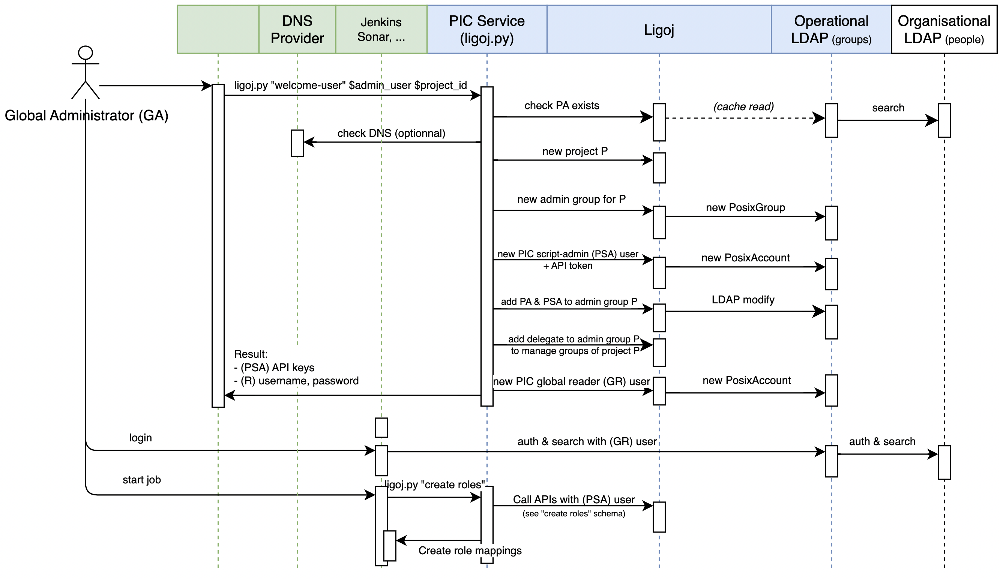
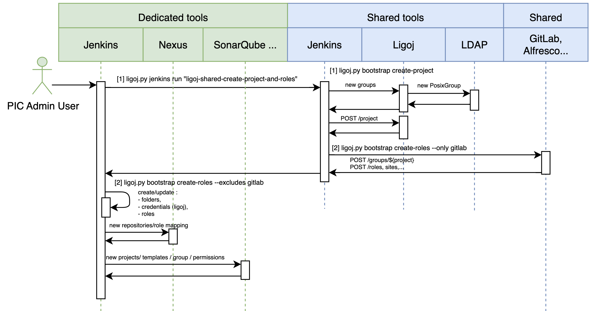
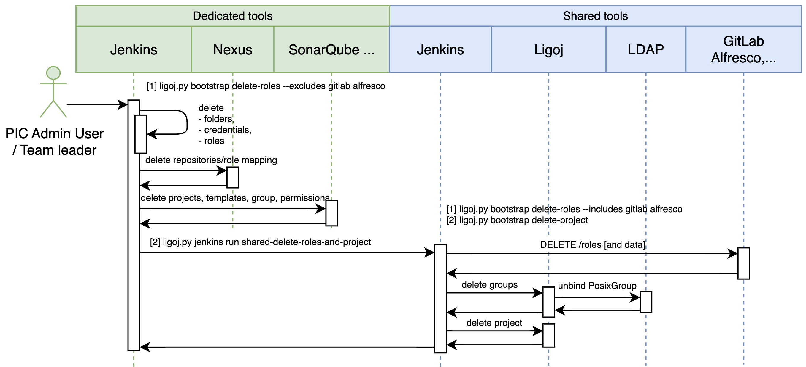

[[_TOC_]]

# Description

Ligoj CLI makes REST calls to a remote Ligoj instance, with parameters and error handling.

# Requirements

- Python 3.11+
- Connectivity and API keys to the target endpoints: `Ligoj` (required) and, for `bootstrap` actions, `Nexus`, `Jenkins`, `SonarQube`
- Valid [credentials](#credentials)

# Installation

Ligoj CLI is published on [PyPI](https://pypi.org/project/ligoj-cli/) as `ligoj-cli` and provides the `ligoj` command.

Install it as an isolated tool with [`uv`](https://docs.astral.sh/uv/) (recommended):

```bash
uv tool install ligoj-cli
ligoj --version
```

Alternatively, use `pipx` or `pip`:

```bash
pipx install ligoj-cli
# or
pip install ligoj-cli
```

To try the latest pre-release published on [TestPyPI](https://test.pypi.org/project/ligoj-cli/):

```bash
pip install -i https://test.pypi.org/simple/ --extra-index-url https://pypi.org/simple/ ligoj-cli
```

For local development from a checkout, see [Development](#development).


# Configuration

## Credentials

Ligoj credentials are based on user/password or user/API Key.

Populate the [configuration files](#configuration-files) with the API key created here [#/api/token ("?" > "Api" > "Token")](http://localhost:8080/ligoj/#/api/token)

You can also:
- use the [session login](#login-with-password) command to get a temporary session
- use the [token](#token) command to create durable API keys

For standard actions, only `LIGOJ_ENDPOINT` is required and can be set either in the [configuration files](#configuration-files), as an environment variable, or as a CLI option.

For `bootstrap` actions, more endpoints and credentials may be required in the [configuration files](#configuration-files).

Sample usage:

```bash
ligoj \
--api-user="ligoj-admin" \
--api-key="..." \
--endpoint="http://localhost:8080/ligoj" \
--version
```

# Commands

## Settings

Options are sourced in the following order of priority, from highest to lowest:

1. Command line options – Overrides settings in any other location, such as the `--output` and `--profile` parameters.
2. Environment variables – You can store values in your system's environment variables.
3. Session file – `default` section or given profile name. The session file is located at `~/.ligoj/sessions` on Linux or macOS and holds:
  - Session cookies set with the [`login`](#login-with-password) command.
  - API keys set with the [`login`](#login-with-api-key) command.
4. Credentials file – `default` section or given profile name. The credentials file is located at `~/.ligoj/credentials` on Linux or macOS.
5. Configuration file – `default` section or given profile name. The config file is located at `~/.ligoj/config` on Linux or macOS. Alternative file `~/.ligoj/cli-config` is supported.


### Configuration files

Sections in these `.ini` files correspond to profile names. When neither the `--profile` option nor the `LIGOJ_PROFILE` environment variable is provided, the default profile is `default` — except for the [`dev`](#dev-environment) command, which defaults to the `dev` profile. See [Profile](#profile) for the full resolution order.

In the file `~/.ligoj/config`, default configurations can be specified. No secrets are sourced from this file.

```ini
[default]
output = "json"
log_level = "DEBUG"
endpoint=http://localhost:8080/ligoj
jenkins_endpoint=http://localhost:8086
sonar_endpoint=http://localhost:9000/

[some]
output = "json"
```

Read-only secrets are stored in the `~/.ligoj/credentials` file. 

Temporary secrets (stored from the [`session`](#session) command) are stored in the `~/.ligoj/sessions` file. 

While `~/.ligoj/credentials` can contain configuration settings, secrets are only sourced from the `~/.ligoj/credentials` and `~/.ligoj/sessions` files.

Sample credential file:
```ini
[default]
api_user = ligoj-user1
api_key = secret
jenkins_api_user = admin
jenkins_api_token = secret
sonar_api_token = secret
```

*Note* Leading spaces are ignored, and enclosing `'` and `"` are removed. Empty strings are ignored.

## Generic options

The generic options are available to all actions.

### Output mode

Determines the output mode of the command. Use the `--output` option. The following modes are available:

- `json` : JSON format
- `text` : Text format

This option can also be specified in [configuration files](#configuration-files) as `output` or in environment variable `LIGOJ_OUTPUT`

```bash
ligoj --output json --version
ligoj --version
```

```json
{"version": "3.3.1-SNAPSHOT"}
```

```bash
ligoj --output text --version
```

```txt
3.3.1-SNAPSHOT
```

### Log level

To configure the verbosity, use the `--log-level` option. The following levels are available:

- `TRACE` level displays the in/out data. `--verbose` and `--trace` are shortcuts for this level.
- `DEBUG` level displays the internal API calls `--debug` is a shortcut for this level.
- `INFO` level displays the actions
- `WARN` level displays the unexpected behaviors
- `ERROR` level displays only fatal errors

This option can also be specified in [configuration files](#configuration-files) as `log-level` or in environment variable `LIGOJ_LOG_LEVEL`

```bash
ligoj --log-level INFO ....
ligoj --verbose ....
ligoj --trace ....
```

If you want to pipe JSON result to `jq`, use `--output json` and `--log-level ERROR` options.


### Insecure server connections

To allow insecure server connections when using SSL, use the `--insecure` option. This option can also be specified in [configuration files](#configuration-files) as `insecure` or in environment variable `LIGOJ_INSECURE`

```bash
ligoj --insecure ....
ligoj --k ....
```

### API user

Ligoj API user name. Use the `--api-user` option. This option can also be specified in [configuration files](#configuration-files) as `api-user` or in environment variable `LIGOJ_API_USER`. By default is `ligoj-admin`.

```bash
ligoj --api-user ligoj-admin ....
```

### API key

Provide an API key, which can be created here [#/api/token ("?" > "Api" > "Token")](https://localhost:8080/ligoj/#/api/token). Use the `--api-key` option. This option can also be specified in [configuration files](#configuration-files) as `api-key` or in environment variable `LIGOJ_API_KEY`

```bash
ligoj --api-key secret ....
```


### API run as user

Ligoj API user name for impersonation. Use the `--api-run-as-user` option. This option can also be specified in [configuration files](#configuration-files) as `api-run-as-user` or in environment variable `LIGOJ_API_RUN_AS_USER`.

Constraints are:
- After the authentication succeeds with [--api-key](#api-key) and [--api-user](#api-user)
- The current user must have `POST /system.user` authorization
- `--api-run-as-user` must exist
- The actions are executed in the name of `--api-run-as-user` and without needing the related credentials.

This option can also be specified in [configuration files](#configuration-files) as `api-run-as-user` or in environment variable `LIGOJ_API_RUN_AS_USER`.

```bash
ligoj --api-run-as-user ligoj-user ....
```


### API local roles

Restrict the computed roles to the local roles of the authenticated user. No plugin roles are involved.
This flag makes the authentication independent of the configured plugins (e.g., availability, misconfiguration, etc.).

Since this flag reduces the set of available roles, there is no restriction on the usage.

This option can also be specified in [configuration files](#configuration-files) as `api-local-roles` or in environment variable `LIGOJ_API_LOCAL_ROLES`.

```bash
ligoj --api-local-roles session get
```


### Profile

A **profile** is a named section shared across the three `.ini` files under `~/.ligoj/` ([`config`, `credentials`, `sessions`](#configuration-files)): the settings, secrets, and session for a given profile all live under the same `[<profile>]` section. Profiles let you keep several isolated sets of endpoints and credentials — for example one per Ligoj instance, or one for the local [dev environment](#dev-environment) — and switch between them without editing files.

Select the profile with the `--profile` option or the `LIGOJ_PROFILE` environment variable:

```bash
ligoj --profile some node list
# or
LIGOJ_PROFILE=some ligoj node list
```

The profile name is resolved in the following order (first match wins):

1. The `--profile` command-line option.
2. The `LIGOJ_PROFILE` environment variable.
3. The default profile, which depends on the command:
   - **`default`** for every command,
   - **`dev`** for the [`dev`](#dev-environment) command — its local development stack reads and writes the `[dev]` section populated by `dev init`.

For example, `ligoj dev demo` uses the `[dev]` profile automatically, while `ligoj node list` uses `[default]`; either can still be overridden with `--profile` or `LIGOJ_PROFILE`.

### From

JSON content to load. Use the `--from` option. The following forms are available:

- Path to a local JSON file
- Remote HTTP URL
- Inline JSON string

After the content has been retrieved, it is interpolated with [Jinja](https://pypi.org/project/Jinja2/) with current project (`project`) and environment variables (`env`) as context:
- For example:
  - `{{ project.id }}` is replaced by the project identifier. 
  - `{{ env.ENV_VAR }}` is replaced by the `ENV_VAR` environment variable value. 
  - `$${_not_existing_property_in_context_}` is replaced by an empty string.
- `null` values are considered as empty string
- The context depends on the current action. Usually, all given parameters are added to the context.
- The context is completed with environment variables.
- Surrounding spaces inside `{{..}}` are ignored

### No color

Disable colors in messages. Use the `--no-color` option. This option can also be specified in [configuration files](#configuration-files) as `no-color` or in environment variable `LIGOJ_NO_COLOR`

```bash
ligoj --no-color ....
```

### Fail on hook error

Fail (exit code 1) when any hook returns a failure status (`X-Ligoj-Hook-*=FAILED`). See [hooks](https://github.com/ligoj/ligoj/blob/master/DOC.md#hook) for more details. Use the `--fail-on-hook-error` option. This option can also be specified in [configuration files](#configuration-files) as `fail-on-hook-error` or in environment variable `LIGOJ_FAIL_ON_HOOK_ERROR`

```bash
ligoj --fail-on-hook-error ....
```

Fail (exit code 1) when any hook returns a failure status (`X-Ligoj-Hook-*=FAILED`). See [hooks](https://github.com/ligoj/ligoj/blob/master/DOC.md#hook) for more details.

Hooks status and message are displayed with `DEBUG` log level:
```log
[DEBUG] [ligoj] Hook 'audit_role_change' status: SUCCEED
[DEBUG] [ligoj] Hook 'audit_role_change' status: FAILED: Message for user
```

## Session

Session operations with credentials and profile management.

### Login with password

Verify the provided user and password and save the returned session cookie into the `~/.ligoj/sessions` file for further API call without providing credentials.

*Note* Secrets like `api-user` and `password` are sourced from the CLI options, sessions and credential files, not from the configuration one.


```bash
ligoj --api-user "ligoj-admin" --profile default session login --password secret
ligoj --api-user "ligoj-admin" login session --password secret
```

Completed `~/.ligoj/sessions` file:

```ini
[default]
session = session_secret_value.node0
api_user = ligoj-admin
```

### Login with api key

Verify the provided user and API key and save the provided API user and API keys into the `~/.ligoj/sessions` file for further API call without providing credentials.

*Note* Secrets like `api-user` and `password` are sourced from the CLI options, sessions and credential files, not from the configuration one.

```bash
ligoj --api-user "ligoj-admin" --api-key "__api_key__" session login
```

### Get session

Return user session details

```bash
ligoj session get
```

```json
{
  "applicationSettings": {
    "buildNumber": "", "buildTimestamp": "", "buildVersion": "3.3.1-SNAPSHOT", 
    "digestVersion": "rRXmeWPgn+...==",
    "plugins": ["feature:welcome:data-rbac"]
  }, 
  "userSettings": {"security-agreement": "1"}, 
  "uiAuthorizations": ["^id/container/group.*", "^id/user.*", "^id/delegate.*", "^message.*", "^id$", "^home.*", "^id/container/company.*", "^api.*", "^id/home.*", ".*"], 
  "apiAuthorizations": [{"pattern": ".*", "method": "DELETE"}], "roles": ["ADMIN", "USER"], "userName": "ligoj-admin"
}
```

### whoami

Return user identifier

```bash
ligoj session whoami
```

```json
{"id": "ligoj-admin"}
```


## System User

A system user can live without federated identity. After a successful login, a federated user can be managed with system roles and API keys.


### Create a system user 

Create a new system user with role names or identifiers.

```bash
ligoj user upsert --id ligoj-admin@sample.com --roles USER ADMIN
```

Optionally, at this time, an API key is generated but only once and only from administrator users.

```bash
ligoj user upsert --id ligoj-admin@sample.com --roles USER ADMIN --api_key_name cli
```

Output the API key only if not existing.

```json
{"id": "__api_key__", "name": "cli"}
```

*Note* When role names are provided API calls are executed to retrieve their identifiers.

### Delete a system user

Delete a system user. The command will not fail if the user is not found.

```bash
ligoj user delete --id ligoj-user
```


### List system users

```bash
ligoj user list
ligoj user list --with-roles
```

```json
{"recordsTotal": 3, "recordsFiltered": 3, "data": ["ligoj-admin", "ligoj-admin@sample.com", "ligoj-user"]}
```

*Note* When role names are provided API calls are executed to retrieve their identifiers.


### Delete a system user 

Create a new system user with role names or identifiers.

```bash
ligoj user delete --id ligoj-user
```


## System Role

A system role holds the permissions (ui and api), and can be assigned to users or groups.


### Create a system role 

Create or update a system role.

**Note** Whereas Ligoj supports per HTTP method authorizations, this feature is not yet available from this CLI action.

```bash
# Deprecated `--id` option
ligoj role create --id ADMIN --api ".*" --ui ".*"
ligoj role create --name ADMIN --api ".*" --ui ".*"
ligoj role create --name SELF_TOKEN_RENEW --api "/api/token.*" --ui "/sys/token"
```

Output is the created/existing role identifier.
```json
123
```

### Delete a system role

Delete a system role. The command will not fail if the role does not exist.

```bash
ligoj role delete --id 1
ligoj role delete --name ADMIN
```

### List system roles

```bash
ligoj role list
```

### Get a system role

```bash
ligoj role get --id 1
ligoj role get --name ADMIN
```

```json
{"id": 1, "createdBy": "_system", "createdDate": 1758279349911, "lastModifiedBy": "_system", "lastModifiedDate": 1758279349911, "name": "ADMIN"}
```

## Info

### Status 

Return API server status

```bash
ligoj info status
```

```json
{"status": "UP"}
```

Optionally, a wait for status can be defined. A regular poll to the server [status](#status) is performed until reaching `DOWN` or `UP` status.
When different from `0`, the final status is returned.

```bash
ligoj info status --wait 20
```

```json
{"status": "DOWN"}
```

### Version

Return API server version

```bash
ligoj info version
ligoj --version
ligoj -v
```

```json
{"version": "3.3.1-SNAPSHOT"}
```


### API Specification

All Ligoj APIs are accessible with REST verbs.

Currently 3 specification formats are available:
- Swagger : Web UI based on OpenAPI JSON file
- OpenAPI JSON file
- [WADL](https://www.w3.org/submissions/wadl/)

```bash
ligoj info api --output openapi --print content
ligoj info api
```

```json
{
  "openapi" : "3.0.1",
  "info" : {
    "title" : "Ligoj API application",
    "description" : "REST API services of application. Includes the core services and the features of actually loaded plugins",
    "contact" : {
      "name" : "The Ligoj team",
      "url" : "https://github.com/ligoj"
```

```bash
ligoj info api --output wadl --print url
ligoj info api --output openapi --print url
ligoj info api --output swagger --print url
```

```text
http://localhost:8080/ligoj/rest?_wadl
http://localhost:8080/ligoj/rest/openapi.json
http://localhost:8080/ligoj/api-docs?url=openapi.json
```

## Token

Manage API keys of current user.

### Create a token

For `expiration` option:
- Either a full ISO date, which corresponds to the furthest date the generated token can be trusted.
- Either a duration starting from now, in a standard duration format. See [pytimeparse](https://pypi.org/project/pytimeparse/)

Expired tokens are neither listed nor returned even if they are not yet physically deleted.

```bash
ligoj token create --id cli_init
ligoj token create --id today_only --expiration 1d
ligoj token create --id SELF_TOKEN_RENEW --expiration 2029-12-31T23:59:59
```

Optionally, the created token can be saved into the current profile, replacing any previously existing one:

Output:

```json
{"id": "__api_key__", "name": "cli_init"}
```

### List tokens

```bash
ligoj token list

["cli_init", "test"]
```

### Get a token value

```bash
ligoj token get --id cli_init

```json
{"value": "__api_key__"}
```

### Delete a token value

```bash
ligoj token delete --id cli_init
```

### Version

Return API server version

```bash
ligoj info version
ligoj --version
ligoj -v
```

```json
{"version": "3.3.1-SNAPSHOT"}
```


## Configuration

Configure global values

### Set value

```bash
ligoj configuration set --id "foo" --value "bar"
ligoj configuration set --id "plugins.repository-manager.nexus.search.url" --value "https://localhost/?g:org.ligoj.plugin"
ligoj configuration set --id "plugins.repository-manager.nexus.search.proxy.host" --value "my-proxy.local"
ligoj configuration set --id "plugins.repository-manager.nexus.search.proxy.port" --value "8080"
ligoj configuration set --id "plugins.repository-manager.nexus.artifact.url" --value "https://nexus.localhost:8443/repository/maven_corporate/org/ligoj/plugin/"
ligoj configuration set --id "cache.id-ldap-data.ttl" --value "3600"

```


*Note* When you change a configuration related to plugin management, invalidate the related caches to retrieve the up-to-date plugin versions.

### Get value

Return the configuration value from its `id`, which can be a Java property name or a stored value in the `S_CONFIGURATION` table.

Return a specific value. Encrypted values are returned as decrypted.

```bash
ligoj configuration get --id "foo"
```

```json
{"value": "bar"}
```

Return all values. Encrypted values are not returned.

```bash
ligoj configuration get
```

```json
[{"name": "COMMAND_MODE", "value": "unix2003", "persisted": false, "secured": false, "overridden": false, "source": "systemEnvironment"},...]
```

### Delete value

```bash
ligoj configuration delete --id "foo"
```

## Cache

### Invalidate cache

```bash
ligoj cache invalidate --id "node-parameters"
ligoj cache invalidate --id "nodes"
ligoj cache invalidate --id "iam-node-configuration"
ligoj cache invalidate --id "id-ldap-data"
ligoj cache invalidate --id "user-details"
ligoj cache invalidate --id "plugins-last-version-nexus"
ligoj cache invalidate
```

### Get cache details

```bash
ligoj cache get --id "user-details"
```

```json
{
    "id": "user-details", 
    "size": 1, 
    "hitCount": 123, 
    "missCount": 14, 
    "hitPercentage": 89.78102, 
    "missPercentage": 10.218978, 
    "averageGetTime": 16.860365, 
    "node": {"id": "00000000-0000-0000-0000-000000000000", "address": "[127.0.0.1]:5701", "version": "5.3.2", "cluster": {"id": "00000000-0000-0000-0000-000000000001", "state": "ACTIVE", "members": [{"id": "00000000-0000-0000-0000-000000000000", "address": "[127.0.0.1]:5701", "version": "5.3.2"}]}}
}
```

```bash
ligoj cache list
```
```json
[
    {"id": "terraform-version", "size": 0, "hitCount": 0, "missCount": 0, "hitPercentage": 0.0, "missPercentage": 0.0, "averageGetTime": 0.0, "node": {"id": "00000000-0000-0000-0000-000000000000", "address": "[127.0.0.1]:5701", "version": "5.3.2", "cluster": {"id": "00000000-0000-0000-0000-000000000001", "state": "ACTIVE", "members": [{"id": "00000000-0000-0000-0000-000000000000", "address": "[127.0.0.1]:5701", "version": "5.3.2"}]}}},
    ...
]
```

## File

A [file](https://github.com/ligoj/ligoj/blob/master/DOC.md#hook) is a remote file readable and/or writable by the API container.

Related path must be authorized by the configuration value `ligoj.file.path`. This check is performed at upload and download times.

```bash
ligoj configuration set --id "ligoj.file.path" --value "^/home/files/.*,^/home/hooks/.*,^/home/ligoj/META-INF/resources/webjars/.*,^/home/ligoj/statics/.*"
```

### Create or update file

Upload a local file to a remote file.

```bash
# Served by UI container, this file will be available from the URL: '/some/icon.png'
ligoj file put --from https://path/to/icon.png --path "/home/ligoj/statics/some/icon.png"

# Served by API container, this file will be available from the URL: '/home/img/logo.svg'
ligoj file put --from docs/ui/logo.svg --path "/home/ligoj/META-INF/resources/webjars/home/img/logo.svg"
```

### Delete file

```bash
ligoj file delete --path "/home/ligoj/icon.png"
```

### Hook get

Download a remote file and save it to a local file.

```bash
ligoj file get --path "/home/ligoj/icon.png"  --out "./icon2.png"
```

## Hook

A [hook](https://github.com/ligoj/ligoj/blob/master/DOC.md#hook) is a command uploaded by a user, and triggered by a successfully invoked API call of Ligoj.

When this command is executed, it receives a `PAYLOAD` event as environment variable.

Related command must be authorized by the configuration value `ligoj.hook.path`. This check is performed at creation and execution time: 

```bash
ligoj configuration set --id "ligoj.hook.path" --value "^/home/ligoj/hooks/.*"
ligoj configuration set --id "ligoj.file.path" --value "^/home/ligoj/hooks/.*"
ligoj file put --from docs/sample_hook_ligoj_audit.sh  --path "/home/ligoj/hooks/ligoj_audit.sh"  --executable
```

Payload structure:

```json
{
  "name":"audit_role_change",
  "now":"2023-10-17T19:22:21Z",
  "result":{"some_json":"some_value"},
  "path":"system/security/role",
  "api":"RoleResource#update",
  "params":[{"id":2652, "name":"ADMIN_PROJECT1A"}, {}],
  "method":"PUT",
  "user":"ligoj-admin",
  "timeout":30,
  "inject": {"secret1":"value1","secret2":"value2"}
}'
```

### Create hook

```bash
# Asynchronous hook
ligoj hook upsert --name "audit_role_change" --command "/home/ligoj/hooks/ligoj_audit.sh" --directory /var/log --timeout 10 --match '{"path":"system/security/role.*"}' --inject secret1 secret2

# Synchronous hook
ligoj hook upsert --name "audit_role_change" --command "/home/ligoj/hooks/ligoj_audit.sh" --directory /var/log --timeout 10 --match '{"path":"system/security/role.*", "method":"POST"}' --inject secret1 secret2 --delay 0
```

**Note** 
- For Docker image runtime, this program is executed by the container `ligoj-api`, and must be resolvable. Either this program is already packaged in the container, or it is mounted as a Docker volume to the host. Usually the mounted volume is `/home/ligoj` and points to the host path such as `/var/path/to/ligoj`. In the above hook sample, the user-level script would be `/var/path/to/ligoj/ligoj_audit.sh`.
- `--name` The human readable hook name. Is displayed in logs and HTTP headers of synchronous executions.
- `--command` The command to execute. Must be allowed by `ligoj.hook.path` configuration. This condition is checked at creation and execution time.
- `--directory` The working directory where the hook is executed.
- `--inject` Can relate to any configuration names supported by the [configuration get](#configuration) command and will be provided in the payload variable.
- `--match` Must be a valid JSON stringified object having :
  * at least the `path` property relating to a valid regular expression matching to one of the available Ligoj's endpoint.
  * an optional `method` property corresponding to ["DELETE", "GET", "HEAD", "OPTIONS", "PATCH", "POST", "PUT", "TRACE"].
- `--delay` The delay in seconds before the hook is executed. Default to `1`. Use `0` for synchronous hooks.
- `--timeout` The timeout in seconds before the hook is executed. Default to `10`.

Sample executable hook script `/home/ligoj/ligoj_audit.sh`:

```bash
#!/bin/bash
payload="$(echo "$PAYLOAD" | base64 -d)"
echo "$(echo "$payload"|jq -r '.now') $(echo "$payload"|jq -r '.method') $(echo "$payload"|jq -r '.path') [$(echo "$payload"|jq -r '.user')]" >> ligoj_audit.log
```

For Docker runtime, to verify this hook would run as expected, try the following command from the host:

```bash
docker exec ligoj-api jq --version
# > jq-1.6
docker exec ligoj-api python3 --version
# > Python 3.11.5
```

### Update hook

For update, `id` or `name` can be used. However, if `name` needs to be updated, provide the `id` as well.

```bash
ligoj hook upsert --id 4 --name "audit_role_change_new" --command "$(pwd)/docs/sample_hook_ligoj_audit.sh" --directory  /var/log --match '{"path":"system/security/role.*"}' --inject "feature:iam:node:primary"  "my-secret"
```

### Delete hook

Deletion can be done by `id` or `name` attribute:

```bash
ligoj hook delete --id 2
ligoj hook delete --name "audit_role_change"
```

### Hook get

Optional `id` or `name` filters are accepted:


```bash
ligoj hook get
ligoj hook get --id 1
ligoj hook get --name "audit_role_change"
```

```json
[{"id": 1, "name": "audit_role_change", "workingDirectory": "/var/log", "command": "/path/to/ligoj_audit.sh", "match": "{\"path\":\"system/security/role.*\"}", "injects": ["java.class.path"]}]
```


## Plugin

### List Ligoj plugins

```bash
ligoj plugin list
```

```json
[
    {
        "id": "feature:ui",
        "name": "Ui",
        "plugin": {
            "id": 4,
            "createdBy": "_system",
            "createdDate": 1758279349900,
            "lastModifiedBy": "_system",
            "lastModifiedDate": 1762277251346,
            "version": "2025-10-31T14:25:16.306432087Z",
            "key": "feature:ui",
            "artifact": "plugin-ui",
            "basePackage": "org.ligoj.app.plugin.ui",
            "type": "FEATURE"
        },
        "location": "/path/to/ligoj-plugins/plugin-ui/target/classes/",
        "deleted": false,
        "nodes": 0,
        "subscriptions": 0
    },
    ...
    {
        "id": "service:id:ldap",
        "name": "Ldap",
        "plugin": {
            "id": 155,
            "createdBy": "_system",
            "createdDate": 1762277251427,
            "lastModifiedBy": "_system",
            "lastModifiedDate": 1762450362232,
            "version": "2025-11-05T22:06:40.787627578Z",
            "key": "service:id:ldap",
            "artifact": "plugin-id-ldap",
            "basePackage": "org.ligoj.app.plugin.id.ldap.resource",
            "type": "TOOL"
        },
        "location": "/path/to/ligoj-plugins/plugin-id-ldap/target/classes/",
        "nodes": 2,
        "node": {
            "id": "service:id:ldap",
            "name": "Identity LDAP",
            "refined": {"id": "service:id","name": "Identity", "mode": "create", "uiClasses": "far fa-id-badge"},
            "mode": "all"
        },
        "subscriptions": 5
    }
]
```

### Install Ligoj plugins

When an explicit version is not provided, the latest version available from Maven Central is used. 

This lookup depends on the `plugins.repository-manager.nexus.search` configuration, while the download relies on `plugins.repository-manager.nexus.artifact` configuration.

```bash
ligoj plugin install --id "plugin-id" --repository "central" --version "2.2.10" --force
ligoj plugin install --id "plugin-id" --version "LATEST" --repository "nexus"
ligoj plugin install --id "plugin-id-ldap" --version "2.1.1" --repository "nexus" --force
ligoj plugin install --id "plugin-req-squash"
ligoj plugin install --id "plugin-req"
```

```log
[INFO ] [ligoj] Plugin 'plugin-req' has been installed/updated, a restart is required
```

Two successful consecutive executions give this output:

```log
[INFO ] [ligoj] Plugin 'plugin-id-ldap:2.0.3' is being installed
[INFO ] [ligoj] Plugin 'plugin-req:1.0.1' is installed but requires a restart to be available
```

*Note* After installing plugins, a restart is needed to use them.

### Restart API

```bash
ligoj plugin restart
```

```json
null
```

Optionally, a wait for status can be defined. A regular poll to the server [status](#status) is performed until reaching `DOWN` or `UP` status.
When different from `0`, the final status is returned.

```bash
ligoj plugin restart --wait 20
```

```json
{"status": "UP"}
```

## Node


### List nodes

```bash
ligoj node list
```

```json
{
  "recordsTotal": 23, 
  "recordsFiltered": 23, 
  "data": [
    {"id": "service:build", "name": "Build", "mode": "link", "uiClasses": "fa fa-cogs", "enabled": true}, 
    {"id": "service:build:jenkins", "name": "Jenkins", "refined": {"id": "service:build", "name": "Build", "mode": "link", "uiClasses": "fa fa-cogs"}, "mode": "all", "uiClasses": "fab fa-jenkins", "enabled": true}, 
    ...
    ]
}
```

Optionally, parameters can be returned with provided mode and other filters

```bash
ligoj node list --parameters-mode "all"
ligoj node list --parameters-mode "all" --search jenkins
ligoj node list --parameters-output "map" --refined "service:build:jenkins"
```

```json
{
  "recordsTotal": 23, 
  "recordsFiltered": 23, 
  "data": [
    {"id": "service:build", "name": "Build", "mode": "link", "uiClasses": "fa fa-cogs", "enabled": true, "parameters": []}, 
    {"id": "service:build:jenkins", "name": "Jenkins", "refined": {"id": "service:build", "name": "Build", "mode": "link", "uiClasses": "fa fa-cogs"}, "mode": "all", "uiClasses": "fab fa-jenkins", "enabled": true, "parameters": []}, 
    {"id": "service:build:jenkins:local", "name": "Jenkins Local", "refined": {"id": "service:build:jenkins", "name": "Jenkins", "refined": {"id": "service:build", "name": "Build", "mode": "link", "uiClasses": "fa fa-cogs"}, "mode": "all", "uiClasses": "fab fa-jenkins"}, "mode": "all", "enabled": true, 
      "parameters": [
        {"text": "-secured-", "parameter": "service:build:jenkins:api-token"}, {"text": "http://localhost:9190/", "parameter": "service:build:jenkins:url"}, 
        {"text": "-secured-", "parameter": "service:build:jenkins:user"}
      ]
    },
    ...
  ]
}
```

### Configure/update a node


If the related node already exists, it is updated.

```bash
ligoj node upsert --id "service:id:ldap:remote1" --name "Remote1" --from ligoj-ldap.json
ligoj node upsert --id "service:id:ldap:remote1" --name "Remote1" --from https://path/to/ligoj-ldap.json
```

```json
{"id": "service:id:ldap:remote1", "name": "Remote1", "mode": "all", "enabled": true}
```

Input `--from` JSON:
- See [`--from`](#--from) for JSON loading options
- JSON can be as list or dict (compact). See sample.
- The parameters marked as sensitive are encrypted in database of Ligoj.

Content of sample [ligoj-ldap.json](docs/nodes/ldap.json) file:

```json
[
  {
      "parameter": "service:id:ldap:base-dn",
      "text": "cn=Test"
  },
  {
      "parameter": "service:id:ldap:uid-attribute",
      "text": "uid"
  }
]
```


### Get node by identifier

```bash
ligoj node get --id "service:id"
ligoj node get --id "service:id:ldap"
ligoj node get --id "service:id:ldap:remote1"
```

```json
{"id": "service:id:ldap:remote1", "name": "Remote1", "mode": "all", "enabled": true}
```

Optionally, parameters can be returned with provided mode

```bash
ligoj node get --id "service:id" --parameters-mode "all"
ligoj node get --id "service:id:ldap" --parameters-mode "all"
ligoj node get --id "service:id:ldap:remote1" --parameters-mode "all"
```

```json
{
  "id": "service:id:ldap:remote1", "name": "Remote1", "mode": "all", "enabled": true,
  "parameters": [
    {"text": "cn=Test", "parameter": "service:id:ldap:base-dn"}, {"bool": true, "parameter": "service:id:ldap:clear-password"}, 
    {"text": "organizationalUnit", "parameter": "service:id:ldap:companies-class"},
    {"text": "-secured-", "parameter": "service:id:ldap:user-dn"}]
}
```

Optionally, parameters can be returned with more details

```bash
ligoj node get --id "service:id:ldap:remote1" --parameters-mode "all" --parameters-output "full"
```

```json
{
  "id": "service:id:ldap:remote1", "name": "Remote1", "mode": "all", "enabled": true,
  "parameters": [{
        "parameter": {
            "id": "service:id:group",
            "type": "text",
            "owner": {
                "id": "service:id",
                "name": "Identity",
                "mode": "create",
                "uiClasses": "far fa-id-badge"
            },
            "mandatory": true,
            "secured": false,
            "depends": []
        }
    },
    {
        "text": "cn=Test",
        "parameter": {
            "id": "service:id:ldap:base-dn",
            "type": "text",
            "owner": {
                "id": "service:id:ldap",
                "name": "Identity LDAP",
                "refined": {
                    "id": "service:id",
                    "name": "Identity",
                    "mode": "create",
                    "uiClasses": "far fa-id-badge"
                },
                "mode": "all"
            },
            "mandatory": false,
            "secured": false,
            "depends": []
        }
    }
  ]
}
```

Optionally, parameter values can be decrypted. One API call is performed for each secured value.

This mode is only available for users having `ADMIN` role.

```bash
ligoj node get --id "service:id:ldap:remote1" --parameters-mode "all" --parameters-output map --parameters-secured
```

```json
{
  "id": "service:id:ldap:remote1", "name": "Remote1", "mode": "all", "enabled": true, 
  "parameters": {
    "service:id:ldap:base-dn": "cn=Test",
    "service:id:ldap:clear-password": true,
    "service:id:ldap:url": "ldap:localhost:1389",
    "service:id:ldap:password": "secret",
    "service:id:ldap:companies-class": "organizationalUnit", 
    "service:id:ldap:companies-dn": "ou=people,dc=sample,dc=com"
  }
}
```

### Get node status

```bash
ligoj node status --id "service:id:ldap:remote1"
```

```json
{"id": "down"}
```

## Delegate node

Node delegates allow users, groups or companies to manage nodes.

Sub nodes inherit the delegate permissions.

### List delegate nodes

```bash
ligoj delegate-node list
```

```json
[
  {"id": 1, "createdBy": "_system", "createdDate": 1758279349979, "lastModifiedBy": "_system", "lastModifiedDate": 1758279349979, "name": "service", "receiver": "ligoj-admin", "receiverType": "user", "canWrite": true, "canAdmin": true, "canSubscribe": true, "referenceID": "service"}
]
```

### Create delegate node

Create a delegate with subscribe, administration, and creation rights for a receiver on an optional node and its sub-nodes.

The provided node does not need to exist yet.

```bash
ligoj delegate-node create --node service --can-subscribe --can-admin --can-write --receiver jdoe --receiver-type user
ligoj delegate-node create --node service:id --can-subscribe --receiver internal --receiver-type company
ligoj delegate-node create --node service:id:ldap:instance1 --can-admin --can-write --receiver group1 --receiver-type group
```

### Delete delegate node

Delete a delegate node from its identifier.

```bash
ligoj delegate-node delete --id 1
```

### Get a delegate node

Get a delegate node from its identifier.

```bash
ligoj delegate-node get --id 1
ligoj delegate-node get --node 1
```


## Project

### List projects

List projects with optional search criteria.

```bash
ligoj project list
ligoj project list --search project1
```

```json
{
  "recordsTotal": 1, 
  "recordsFiltered": 1, 
  "data": [
    {
      "id": 153, 
      "createdDate": 1705853880193, "lastModifiedDate": 1705853880193, 
      "createdBy": { "id": "ligoj-admin", ...}, 
      "lastModifiedBy": {"id": "ligoj-admin", ...}, 
      "name": "Project 1",
      "teamLeader": {"id": "ligoj-admin", ...}, 
      "pkey": "project1", 
      "description": "",
      "nbSubscriptions": 2
    },
    ...
  ]
}
```
### Get Project

```bash
ligoj project get --id 153
ligoj project get --id "project1"
```

```json
{
  "id": 153, 
  "createdDate": 1705853880193, "lastModifiedDate": 1705853880193, 
  "createdBy": { "id": "ligoj-admin", ...}, 
  "lastModifiedBy": {"id": "ligoj-admin", ...}, 
  "name": "Project 1",
  "teamLeader": {"id": "ligoj-admin", ...}, 
  "pkey": "project1", 
  "description": "",
  "manageSubscriptions": true, 
  "subscriptions": [
    {"id": 355, ...},
    {"id": 362, ...}
  ]
}
```

### Create Project

```bash
ligoj project create --name "project4" --team-leader "ligoj-admin" --pkey "sample:project4" --description "Sample project 4" --context='{"some":"value"}'
```

```json
{
  "id": 352, 
  "creationContext": "{\"some\":\"value\"}", 
  "name": "project4", 
  "teamLeader": {"id": "ligoj-admin",...},
  "pkey": "sample:project4", 
  "description": "Sample project 4",
  ...
}
```

### Delete Project

Delete project with optional search criteria.

```bash
ligoj project delete --id 252
ligoj project delete --id "sample:project4"
ligoj project delete --id "sample:project4" --with-data
```


## Subscription operations

### List subscriptions

Combined filters are accepted.

```bash
ligoj subscription list --node "service:id:ldap:remote1"
ligoj subscription list --tool "service:id:ldap"
ligoj subscription list --service "service:id"
ligoj subscription list --project "project1"
ligoj subscription list --project 104
```

```json
[
  {"id": 155, "node": "service:id:ldap:remote1", "project": 104}, 
  {"id": 302, "node": "service:qa:sonarqube:8", "project": 104}
]
```

### Get subscription details

```bash
ligoj subscription get --id 302
```

```json
{"service:qa:sonarqube:project": "test", "service:qa:sonarqube:url": "http://127.0.0.1:9000/"}
```

#### With related project and node details

```bash
ligoj subscription get --id 302 --details
```

```json
{"subscription": 302, "project": {"id": 104, "name": "Project1", "description": "Foo bar"}, "parameters": {"service:qa:sonarqube:project": "test", "service:qa:sonarqube:url": "http://127.0.0.1:9000/"}, "node": {"id": "service:qa:sonarqube:8", "name": "Sonar Local 8", "refined": {"id": "service:qa:sonarqube", "name": "SonarQube", "refined": {"id": "service:qa", "name": "Quality Assurance", "mode": "link", "uiClasses": "fas fa-tachometer-alt"}, "mode": "link"}, "mode": "link", "enabled": true}}
```

### Create subscription

Configuration file can be a JSON file, a remote HTTP URL, or plain JSON.  Both forms of parameters are accepted, as list or dict (compact).

Duplicate subscriptions are ignored: same project, node and parameters.

```bash
ligoj subscription create --project project1 --node "service:id:ldap:remote1" --from conf.json
ligoj subscription create --project project1 --node "service:id:ldap:remote1" --from "https://path/to/conf.json"
ligoj subscription create --project project1 --node "service:id:ldap:remote1" --from '[{"parameter": "service:id:group", "text": "project1-team"}, {"parameter": "service:id:ou", "text": "project1"}]'
ligoj subscription create --project project1 --node "service:id:ldap:remote1" --from '{"service:id:group": "project1-team", "service:id:ou": "project1"}'
...
```

```json
362
```

Input `--from` JSON:
- See [`--from`](#--from) for JSON loading options
- JSON can be as list or dict (compact). See sample.
- The parameters marked as sensitive are encrypted in database of Ligoj.

### Delete a subscription

Delete a subscription from its identifier. 


```bash
ligoj subscription delete --id 302
```

By default, only the link between Ligoj and the remote tool is removed. Optionally, when Ligoj has created data with the subscription, it can also be deleted with this operation.

For example, LDAP groups or a Jenkins job created at subscription time will be deleted.

```bash
ligoj subscription delete --id 302 --with-data
```

### Get subscription statuses of a project

Return the last computed status of all subscriptions of given project.

```bash
ligoj subscription status --project 104
ligoj subscription status --project project1
```

```json
{
  "155": {"specifics": [], "value": "UP", "type": "status", "node": {"id": "service:id:ldap:remote1", "name": "TestAnnuaireCLI", "mode": "all"}, "subscription": 155}, 
  "252": {"specifics": [], "value": "DOWN", "type": "status", "node": {"id": "service:qa:sonarqube:user", "name": "Sonar Local User", "mode": "link"}, "subscription": 252},
  "157": {"specifics": [], "value": "UP", "type": "status", "node": {"id": "service:id:ldap:remote1", "name": "TestAnnuaireCLI", "mode": "all"}, "subscription": 157}
}
```

### Request subscription status refresh

Retrieve the up-to-date status of a subscription.


Up subscription:

```bash
ligoj subscription refresh --id 155
```

```json
{"id": 155, "status": "up", "node": "service:id:ldap:remote1", "project": 104, "data": {"members": 0}, "parameters": {...}}
```

Down subscription:
```bash
ligoj subscription refresh --id 252
```

```json
{"id": 252, "status": "down", "project": 104, "data": {}, "parameters": {"service:qa:sonarqube:project": "test",...}}
```


# Plugin id

Operations related to [plugin-id](https://github.com/ligoj/plugin-id) and sub-plugins.


## Plugin `id:scope` operations

Operations related to container scopes managed by `service:id` nodes.


### Create container scope

Create a container scope

```bash
ligoj id:scope create --id "Unassigned" --type "group" --dn "ou=groups,dc=example,dc=com"
ligoj id:scope create --id "Projects" --type "group" --dn "ou=project,ou=groups,dc=example,dc=com"
ligoj id:scope create --id "Tools" --type "group" --dn "ou=tools,ou=groups,dc=example,dc=com"
ligoj id:scope create --id "Unassigned" --type "company" --dn "ou=people,dc=example,dc=com"
ligoj id:scope create --id "Internal" --type "company" --dn "ou=internal,ou=people,dc=example,dc=com"
ligoj id:scope create --id "Unassigned" --type "tree" --dn "dc=example,dc=com"
```


### Get container scope

Return a container scope

```bash
ligoj id:scope get --id "SampleGroup2"
```

```json
{"id": "samplegroup2", "name": "SampleGroup2", "scope": "Unassigned", "locked": false}
```


### List container scopes

Return a list of container scopes

```bash
ligoj id:scope list --type "group"
```

```json
{
  "recordsTotal": 4, "recordsFiltered": 3, 
  "data": [
    {"id": 5, "name": "Unassigned", "dn": "ou=groups,dc=sample,dc=com", "type": "group", "locked": false}, 
    {"id": 6, "name": "Project", "dn": "ou=project,ou=groups,dc=sample,dc=com", "type": "group", "locked": false}, 
    {"id": 7, "name": "Technical", "dn": "ou=tools,ou=groups,dc=sample,dc=com", "type": "group", "locked": false}
  ]
}
```

## Plugin `id:group` operations

Operations related to groups managed by `service:id` nodes

Group name is case insensitive.


### Create group

Create a group.


```bash
ligoj id:group create --name "SampleGroup2" --scope "Unassigned"
```

Create a group inside a group

```bash
ligoj id:group create --name "SampleSubGroup" --scope "Unassigned" --parent "SampleGroup2"
ligoj id:group create --name "SampleSubGroup2" --scope "Unassigned" --parent "SampleSubGroup"
```


### Delete a group

Delete a group. The command will not fail if the group does not exist.

```bash
ligoj id:group delete --name "SampleGroup2"
```


### Get group

Retrieve a group

```bash
ligoj id:group get --name "SampleGroup2"
```

```json
{"id": "samplegroup2", "name": "SampleGroup2", "scope": "Unassigned", "locked": false}
```

### Delete group

Delete a group. If the group does not exist, the command will not return an error.

```bash
ligoj id:group delete --name "SampleGroup2"
```


### List group

List groups

```bash
ligoj id:group list
```

```json
{
    "recordsTotal": 4,
    "recordsFiltered": 4,
    "data": [
        {
            "id": "sample group",
            "name": "Sample Group",
            "scope": "Unassigned",
            "locked": false,
            "countVisible": 3,
            "count": 3,
            "canWrite": true,
            "canAdmin": true,
            "containerType": "group"
        },
        {
            "id": "samplegroup2",
            "name": "SampleGroup2",
            "scope": "Unassigned",
            "locked": false,
            "countVisible": 0,
            "count": 0,
            "canWrite": true,
            "canAdmin": true,
            "containerType": "group"
        },
        {
            "id": "samplesubgroup",
            "name": "SampleSubGroup",
            "scope": "Unassigned",
            "locked": false,
            "countVisible": 0,
            "count": 0,
            "canWrite": true,
            "canAdmin": true,
            "containerType": "group",
            "parents": [
                "samplegroup2"
            ]
        },
        {
            "id": "samplesubgroup2",
            "name": "SampleSubGroup2",
            "scope": "Unassigned",
            "locked": false,
            "countVisible": 0,
            "count": 0,
            "canWrite": true,
            "canAdmin": true,
            "containerType": "group",
            "parents": [
                "samplesubgroup",
                "samplegroup2"
            ]
        }
    ]
}
```

## Plugin `id:user` operations

Operations related to users managed by `service:id` nodes


### Create user

```bash
ligoj id:user create --id jdupont --firstname "Jean" --lastname "Dupont" --mail "jdupont@kloudy.io" --company "external" --groups "Sample Group,SampleGroup2"
ligoj id:user create --id jdupont2 --firstname "Jean" --lastname "Dupont" --mail "jdupont@kloudy.io" --company "external" --groups "Sample Group,SampleGroup2"
```

### Delete user

Delete a user. If the user does not exist, the command will not return an error.

```bash
ligoj id:user delete --id jdupont2
ligoj id:user delete --mail jdupont@kloudy.io
```

### List users

```bash
ligoj id:user list
ligoj id:user list --company "department1" --group "Sample Group" --criteria "@sample.com" --page-length 2
ligoj id:user list --company "department1" --page-length 2
```

```json
{
  "recordsTotal": 102, 
  "recordsFiltered": 102,
  "extensions": {"customAttributes": ["uidFonctionnel"]}},
  "data": [
    {"firstName": "John", "lastName": "Doe", "id": "jdoe", "company": "external", "mails": ["jdoe@sample.com"], "groups": ["Sample Group", "SampleGroup2"], "name": "jdoe"}, 
    {"firstName": "Cli2", "lastName": "Name", "id": "cli2name", "company": "external", "mails": ["a@bc.org","cli2@sample.com"], "groups": ["Sample Group"], "name": "cli2name"}
  ]
}
```
### Get user

Return a user. If the user does not exist, the command will return `null`.

```bash
ligoj id:user get --id jdupont
ligoj id:user get --mail jdupont@kloudy.io
```

```json
{"firstName": "Jean", "lastName": "Dupont", "id": "jdupont", "company": "external", "mails": ["jdupont@kloudy.io"], "groups": ["Sample Group", "SampleGroup2"], "name": "jdupont"}
```

### Add user to a group

The user and the group must exist.
The command does not fail if the user is already in the group.

```bash
ligoj id:user add --id jdupont --groups "SampleGroup2"
ligoj id:user add --mail jdupont@kloudy.io --groups "SampleGroup2"
ligoj id:user add --mail cli10.name@sample.com --groups "Sample Group"
```

### Remove user from a group

The user and the group must exist.
The command does not fail if the user is not in the group.

```bash
ligoj id:user remove --id jdupont --groups "SampleGroup2"
ligoj id:user remove --mail jdupont@kloudy.io --groups "SampleGroup2"
```

### Reset user password

For a specific user (need administrative rights):

The user must exist.

```bash
ligoj id:user reset-password --id jdupont
ligoj id:user reset-password --mail jdupont@kloudy.io
```

For current user:

```bash
ligoj id:user reset-password
```

# Plugin prov

Operations related to [plugin-prov](https://github.com/ligoj/plugin-prov) and its provider
sub-plugins (AWS, Azure, GCP, …), exposed under `prov:<resource>` services. They drive a
*provisioning quote* identified by a **subscription** id (`--subscription`/`-s`), the project's
subscription to a `service:prov:*` node.

| Service          | Actions                                          | REST base                          |
| ---------------- | ------------------------------------------------ | ---------------------------------- |
| `prov:quote`     | `get`, `update`, `refresh`, `refresh-cost`, `locations` | `service/prov/{subscription}` |
| `prov:instance`  | `lookup`, `create`, `update`, `delete`, `delete-all` | `service/prov/instance`        |
| `prov:container` | `lookup`, `create`, `update`, `delete`, `delete-all` | `service/prov/container`       |
| `prov:database`  | `lookup`, `create`, `update`, `delete`, `delete-all` | `service/prov/database`        |
| `prov:function`  | `lookup`, `create`, `update`, `delete`, `delete-all` | `service/prov/function`        |
| `prov:storage`   | `lookup`, `create`, `update`, `delete`, `delete-all` | `service/prov/storage`         |
| `prov:support`   | `lookup`, `create`, `update`, `delete`, `delete-all` | `service/prov/support`         |
| `prov:usage`     | `list`, `create`, `update`, `delete`             | `service/prov/{subscription}/usage` |
| `prov:budget`    | `list`, `create`, `update`, `delete`             | `service/prov/{subscription}/budget` |
| `prov:optimizer` | `list`, `create`, `update`, `delete`             | `service/prov/{subscription}/optimizer` |
| `prov:tag`       | `create`, `update`, `delete`                     | `service/prov/{subscription}/tag` |
| `prov:catalog`   | `list`, `status`, `update`, `cancel`             | `service/prov/catalog`             |
| `prov:upload`    | `resources`                                      | `service/prov/{subscription}/upload` |

Run `ligoj prov:<service> --help` (and `... <action> --help`) for the full argument list. Every
`create`/`update` also accepts `--data '<json>'` to set or override any backend field not exposed
as a flag.


## Quote configuration (`prov:quote`)

```bash
# Inspect the full quote (resources + total cost)
ligoj prov:quote get --subscription 12

# Set defaults and recompute
ligoj prov:quote update -s 12 --location "eu-west-1" --usage "dev" --license "BYOL"
ligoj prov:quote refresh -s 12
```


## Compute, database, container, function

The typical flow is *lookup a price → create the resource with that price id*:

```bash
# 1. find the cheapest instance matching the requirement
ligoj prov:instance lookup -s 12 --cpu 2 --ram 4096 --os LINUX

# 2. create it from the returned price id
ligoj prov:instance create -s 12 --name "web" --price 4211 --cpu 2 --ram 4096 \
    --os LINUX --internet PUBLIC --min-quantity 1 --max-quantity 3

# database / container / function follow the same pattern
ligoj prov:database create -s 12 --name "db" --price 5120 --cpu 1 --ram 2048 --engine MYSQL
ligoj prov:function create -s 12 --name "fn" --price 77 --runtime Python --nb-requests 5

# update / delete
ligoj prov:instance update -s 12 --id 99 --max-quantity 5
ligoj prov:instance delete --id 99
ligoj prov:instance delete-all -s 12
```


## Storage, usage, budget, optimizer, tag

```bash
ligoj prov:storage create -s 12 --name "data" --type "gp2" --size 100 --instance 99
ligoj prov:usage create   -s 12 --name "dev"  --rate 50 --duration 12
ligoj prov:budget create  -s 12 --name "2026" --initial-cost 10000
ligoj prov:tag create     -s 12 --name "env" --value "prod" --type INSTANCE --resource 99
```


## Catalog and bulk upload

```bash
# trigger and follow a provider catalog import
ligoj prov:catalog update --node "service:prov:aws:test" --force
ligoj prov:catalog status --node "service:prov:aws:test"

# bulk-create resources from a CSV
ligoj prov:upload resources -s 12 --from ./resources.csv --merge update
```

# Plugin build

Operations related to [plugin-build](https://github.com/ligoj/plugin-build) and its CI provider
sub-plugins (Jenkins, Travis), exposed under the `build:job` service. The build provider is taken
from `--provider`, inferred from the `--node` identifier (`service:build:<provider>:…`), or resolved
from the subscription's node.

> Note: this drives the **Ligoj** build service (`service/build/<provider>`). The separate `jenkins`
> service talks **directly** to a Jenkins server instead.

| Action      | Arguments                          | REST                                               |
| ----------- | ---------------------------------- | -------------------------------------------------- |
| `trigger`   | `--subscription` [`--provider`]    | `POST service/build/<provider>/build/{subscription}` |
| `find`      | `--node --criteria` [`--provider`] | `GET service/build/<provider>/{node}/{criteria}`   |
| `templates` | `--node --criteria` [`--provider`] | `GET service/build/<provider>/template/{node}/{criteria}` (Jenkins) |
| `get`       | `--node --id` [`--provider`]       | `GET service/build/<provider>/{node}/job/{id}`     |

```bash
# Trigger the build configured for a subscription (provider inferred from the subscription)
ligoj build:job trigger --subscription 42

# Search jobs / templates on a node (provider inferred from the node)
ligoj build:job find      --node "service:build:jenkins:dev" --criteria "my-app"
ligoj build:job templates --node "service:build:jenkins:dev" --criteria "template"

# Return a single job by id
ligoj build:job get --node "service:build:jenkins:dev" --id "my-app"
```

# Dev environment

`dev init` brings up, on **Kubernetes**, the backing services a Ligoj developer needs and wires the
resulting endpoints and credentials into the **`[dev]` section** of `~/.ligoj/credentials`. Every
`dev` command uses the `dev` [profile](#profile) by default (no `--profile` needed), and the
generated `[dev]` profile can be reused by any other command with `--profile dev`.

> Unlike every other command, `dev` is purely local and does **not** require `LIGOJ_ENDPOINT`.

Two runtimes, both driven by **podman** — no heavyweight cluster unless you ask for Harbor:

- **`podman kube play`** for every self-contained service. Each becomes a `Pod` (manifest written to
  `~/.ligoj/dev/k8s/<service>.yaml`); `PersistentVolumeClaim`s map to podman named volumes so data
  survives restarts. A pre-existing raw container of the same name is migrated to a pod automatically.
- **a `kind` cluster** (podman provider, `ligoj-dev`) created on demand **only for Harbor**, which
  needs a real cluster; Harbor is installed with its Helm chart and exposed on `localhost` via a
  NodePort + kind `extraPortMappings`.

The init phase **bootstraps its own tooling**: a missing CLI (`podman`, and `kind`/`helm`/`kubectl`
for Harbor) is installed with Homebrew, and the podman machine is initialized/started as needed — so
a fresh machine can go from nothing to a running stack with one command. (If Homebrew is absent, you
get a clear message to install the tool yourself.) The whole stack (GitLab + SonarQube + Nexus +
Artifactory + kind at once) is heavy, so `dev init` also **enforces the podman machine's resources**:
if it has fewer than **6 vCPU** or **23 GB RAM** it is **stopped, resized up to that minimum, and
restarted** (a fresh machine is created already sized; a machine that already exceeds the minimum is
left untouched). On macOS it also checks the tools `dev demo` needs
later — **Java 21** (installed as the Temurin JDK cask via Homebrew) and **Maven 3.9.6** (installed
via [SDKMAN](https://sdkman.io), bootstrapped if missing); these two are best-effort and never abort
`init`. Pass `--skip-prereqs` to skip all these checks. Each service streams live progress and is
**idempotent** — a running pod is reused; use `--recreate` to replace it.

| Service      | Pod / release | Default port | Image                                 | What `dev init` configures |
| ------------ | ------------- | ------------ | ------------------------------------- | -------------------------- |
| `postgresql` | `ligoj-db`    | `5432`       | `postgres:17`                         | `ligoj/ligoj` user/db (what `ligoj-api` expects), persistent volume `ligoj_db_data` |
| `openldap`   | `openldap`    | `1389`       | `bitnamilegacy/openldap:latest`       | `Manager` / `dc=sample,dc=com`; generates the admin password if missing; volume `openldap_data` |
| `keycloak`   | `keycloak`    | `9083`       | `quay.io/keycloak/keycloak:26.6.1`    | **backed by the shared `postgresql`** (dedicated `keycloak` database); realm `ligoj`, LDAP user federation, confidential `ligoj` client; prints Spring Boot properties |
| `jenkins`    | `jenkins`     | `8085`       | `jenkins/jenkins:2.570-slim-jdk25`    | volume `jenkins_home`; provisions the admin user and generates an API token |
| `sonarqube`  | `sonarqube`   | `9000`       | `sonarqube:26.6.0.123539-community`   | **backed by the shared `postgresql`** (dedicated `sonarqube` database); changes the default admin password and creates an API token |
| `gitlab`     | `gitlab`      | `8929` (+ssh `2289`) | `gitlab/gitlab-ce:latest`     | omnibus CE (single container), trimmed footprint; root password in `[dev]` |
| `harbor`     | `harbor` (Helm, on `kind`) | `8088`  | `goharbor/harbor` chart            | minimal Harbor (no trivy/metrics); admin password in `[dev]` |
| `nexus`      | `nexus`       | `8181`       | `sonatype/nexus3:latest`              | volume `nexus_data`; resets the generated initial admin password and stores it in `[dev]` (host `8181` leaves `8081` free for the Ligoj API) |
| `artifactory`| `artifactory` | `8082`       | `jfrog/artifactory-oss:7.111.9` (pinned) | **backed by the shared `postgresql`** (dedicated `artifactory` database, Derby is refused), volume `artifactory_data`; admin `password` in `[dev]`. Forces IPv4, **self-heals a hung boot** (see below), and is **pinned below 7.125** to keep the web UI usable (see below) |
| `argocd`     | `argocd` (Helm, on `kind`) | `8083`  | `argo/argo-cd` chart               | `role:ligoj` RBAC + `ligoj` account & API token; Dex **LDAP federation** to OpenLDAP |

## Options

| Option        | Description                                                                 |
| ------------- | --------------------------------------------------------------------------- |
| `--only`, `-O` | Limit to a subset, e.g. `--only postgresql keycloak` (default: all)        |
| `--recreate`, `-R` | Delete and recreate the pods / kind cluster (named volumes are kept)    |
| `--wait`, `-w` | How long to wait for readiness, with **live progress**: omit = wait until done or Ctrl+C; `0` = no wait (skip readiness/token steps); `N` = up to N seconds. Also accepted by `start` / `stop` / `restart`. |
| `--ldap-port` / `--jenkins-port` / `--sonar-port` / `--db-port` / `--keycloak-port` / `--gitlab-port` / `--harbor-port` / `--nexus-port` / `--artifactory-port` / `--argocd-port` | Override a host port |

Every value can also be set in the `[dev]` section or as an environment variable. The credentials
are **read** before a secret is generated, so you stay in control:

| Service      | Inputs (option · env · `[dev]` key)                                                                 |
| ------------ | -------------------------------------------------------------------------------------------------- |
| `postgresql` | `DB_IMAGE`·`db_image`, `DB_PORT`·`db_port`, `POSTGRES_USER`·`db_user`, `POSTGRES_PASSWORD`·`db_password`, `POSTGRES_DB`·`db_name` |
| `openldap`   | `LDAP_IMAGE`·`ldap_image`, `LDAP_PORT`·`ldap_port`, `LDAP_ADMIN_USERNAME`·`ldap_admin_user`, `LDAP_ROOT`·`ldap_root`, `LDAP_ADMIN_PASSWORD`·`ldap_admin_password`, `LDAP_SCHEMA_DIR`·`ldap_schema_dir` |
| `keycloak`   | `KEYCLOAK_IMAGE`·`keycloak_image`, `KEYCLOAK_PORT`·`keycloak_port`, `KC_BOOTSTRAP_ADMIN_USERNAME`·`keycloak_admin_user`, `KC_BOOTSTRAP_ADMIN_PASSWORD`·`keycloak_admin_password`, `KEYCLOAK_LDAP_URL`·`keycloak_ldap_url`, `KEYCLOAK_DB_PASSWORD`·`keycloak_db_password` (shared-DB role) |
| `jenkins`    | `JENKINS_IMAGE`·`jenkins_image`, `JENKINS_PORT`·`jenkins_port`, `JENKINS_API_USER`·`jenkins_api_user`, `JENKINS_ADMIN_PASSWORD`·`jenkins_admin_password`, `JENKINS_API_TOKEN`·`jenkins_api_token` |
| `sonarqube`  | `SONAR_IMAGE`·`sonar_image`, `SONAR_PORT`·`sonar_port`, `SONAR_ADMIN_PASSWORD`·`sonar_admin_password`, `SONAR_DB_PASSWORD`·`sonar_db_password` (shared-DB role) |
| `gitlab`     | `GITLAB_IMAGE`·`gitlab_image`, `GITLAB_PORT`·`gitlab_port`, `GITLAB_SSH_PORT`·`gitlab_ssh_port`, `GITLAB_ROOT_PASSWORD`·`gitlab_root_password` |
| `harbor`     | `HARBOR_PORT`·`harbor_port`, `HARBOR_NODE_PORT`·`harbor_node_port`, `HARBOR_ADMIN_PASSWORD`·`harbor_admin_password`, `HARBOR_REDIS_IMAGE`·`harbor_redis_image` |
| `nexus`      | `NEXUS_IMAGE`·`nexus_image`, `NEXUS_PORT`·`nexus_port`, `NEXUS_ADMIN_PASSWORD`·`nexus_admin_password` |
| `artifactory`| `ARTIFACTORY_IMAGE`·`artifactory_image`, `ARTIFACTORY_PORT`·`artifactory_port`, `ARTIFACTORY_USER`·`artifactory_user`, `ARTIFACTORY_PASSWORD`·`artifactory_password`, `ARTIFACTORY_DB_PASSWORD`·`artifactory_db_password` (shared-DB role), `ARTIFACTORY_HEAL_AFTER`·`artifactory_heal_after` (boot self-heal grace, default `90`, `0` disables) |
| `argocd`     | `ARGOCD_PORT`·`argocd_port`, `ARGOCD_NODE_PORT`·`argocd_node_port` (LDAP fields reuse the `openldap` keys) |

In return, `dev init` **writes** to `[dev]`: `db_*` (host/port/name/user/password/url), `ldap_url` and
`ldap_admin_password`, `keycloak_endpoint` / `keycloak_admin_password` / `keycloak_client_secret` /
`keycloak_issuer_uri` / `keycloak_db_password`, `jenkins_endpoint` / `jenkins_admin_password` / `jenkins_api_token`,
`sonar_endpoint` / `sonar_admin_password` / `sonar_api_token` / `sonar_db_password`, `gitlab_endpoint` /
`gitlab_root_password` / `gitlab_token`, `harbor_endpoint` / `harbor_admin_password`,
`nexus_endpoint` / `nexus_admin_password`, `artifactory_endpoint` / `artifactory_password` /
`artifactory_db_password`, and
`argocd_endpoint` / `argocd_admin_password` / `argocd_account` / `argocd_api_token`. **Keycloak**,
**SonarQube** and **Artifactory** each get a dedicated role + database in the shared `postgresql`
(reached from their pods via `host.containers.internal`). For **Jenkins**,
**SonarQube**, **GitLab** and **ArgoCD** an API token is generated (and reused on later runs), so
`--profile dev` can drive their APIs straight away. The **GitLab** token is a `root` personal access
token minted via the Rails console (`api`, `read_api`, `read_repository`, `write_repository` scopes).

```bash
# Bring up the whole local stack (Harbor pulls in a kind cluster)
ligoj dev init

# Only the database and Keycloak, on custom ports
ligoj dev init --only postgresql keycloak --db-port 5432 --keycloak-port 9083

# Recreate Jenkins to apply a freshly configured admin token
JENKINS_API_USER=admin JENKINS_API_TOKEN="$(cat token.txt)" ligoj dev init --only jenkins --recreate

# Reuse the generated credentials in subsequent commands
ligoj --profile dev sonar project list
```

> **Footprint**: GitLab (~4 GB) and Harbor (a kind node + ~7 pods) are heavy; running all services at
> once needs a roomy podman machine. Use `--only` to bring up just what you need.

> **Data safety**: for `postgresql`, an existing `ligoj-db` keeps its current data source (named
> volume *or* host bind mount) and image **even on `--recreate`**, so a `--recreate` never orphans
> the database nor swaps the PostgreSQL major version under an existing data directory.

## Status

`dev status` reports, for every service, its runtime state, a health probe **from the host** and the
URL to reach it — handy after an `init` or to see what is still up:

```text
SERVICE     STATUS          HEALTH  URL
----------  --------------  ------  ---------------------------------------
postgresql  running         OK      postgresql://ligoj@localhost:5432/ligoj
openldap    running         OK      ldap://localhost:1389
keycloak    running         OK      http://localhost:9083
jenkins     running         OK      http://localhost:8085
sonarqube   running         OK      http://localhost:9000
gitlab      running         OK      http://localhost:8929
harbor      running (kind)  OK      http://localhost:8088
nexus       running         OK      http://localhost:8181
artifactory running         OK      http://localhost:8082/artifactory
```

`STATUS` is the pod (or, for Harbor, the kind cluster) state — `running` / `stopped` / `absent`;
`HEALTH` is probed from your machine (an HTTP check for web services, a TCP connect for
PostgreSQL/LDAP). It reads the ports/URLs recorded in `[dev]`, so it works without contacting podman.

### Artifactory boot self-heal

Artifactory's JFrog microservice mesh occasionally deadlocks on boot: the internal services fail to
join over `localhost` (they try the IPv6 `::1` loopback and get *connection refused*), so the
container stays up but its router never binds `:8082` — the port `dev` and the Ligoj node probe — and
the readiness wait would otherwise hang forever. Two mitigations are built in: the pod is started
with `-Djava.net.preferIPv4Stack=true`, and if the router is still not listening after a grace period
(default **90 s**, set `ARTIFACTORY_HEAL_AFTER` seconds, `0` disables) the wait **restarts the pod
once** — a fresh boot usually wins the race (~40 s). A healthy-but-slow boot (which answers `503`
while starting) is never restarted.

### Artifactory version pin (usable UI)

The image is pinned to `artifactory-oss:7.111.9`, **not** `:latest`, on purpose. From ~7.125 the OSS
web UI's frontend service (`jffe`) is stuck in an unbounded retry loop on a *"first-time entitlement
fetch"* — a licensing/entitlements gRPC call that returns **404 UNIMPLEMENTED** because that service
ships only with the commercial JFrog Platform, not OSS. Until it "succeeds" (it never does) `jffe`
won't serve UI data, so **every** `/ui/api/v1/ui/*` call hangs ~12 s and the UI is effectively
unusable (long JFrog splash, every screen crawls). The REST API and all `dev demo` Maven operations
are unaffected — only the browser UI. Tested across versions: 7.146/7.133/7.125 all hang; **7.111.9**
is the newest OSS tag whose UI answers in milliseconds with no entitlement loop. (The many `404`s the
browser logs for `xray`, `mc`, `distribution`, `apptrust`, … microfrontends are unrelated and
harmless — those are commercial modules absent from OSS.) Override the pin with `ARTIFACTORY_IMAGE` /
`[dev] artifactory_image` if you need a specific version; a **downgrade needs a fresh volume and
database** (`podman pod rm -f artifactory`, `podman volume rm artifactory_data`, and drop the
`artifactory` DB), because a newer schema/master-key won't start on an older binary.

## Per-service config

`dev config <service>` prints the key properties of a single service — URL, admin user and password,
and the other connection details — read straight from `[dev]`:

```text
# sonarqube
url             http://localhost:9000
admin user      admin
admin password  v1JE…
api token       squ_…
```

Works for `postgresql`, `openldap`, `keycloak`, `jenkins`, `sonarqube`, `gitlab`, `harbor`, `nexus`,
`artifactory` and `argocd`. Each
service adds its own relevant fields — e.g. PostgreSQL the host/port/database, OpenLDAP the bind/base
DN, Keycloak the realm + issuer URI + client id/secret, GitLab the SSH URL, Harbor the registry host.

Omit the service to get a summary **table** of every service at once:

```text
SERVICE     URL                                      USER     PASSWORD  TOKEN/SECRET
----------  ---------------------------------------  -------  --------  ------------
postgresql  postgresql://ligoj@localhost:5432/ligoj  ligoj    ligoj     -
keycloak    http://localhost:9083                    admin    admin     z1n7…
jenkins     http://localhost:8085                    admin    cfu_…     11651…
sonarqube   http://localhost:9000                    admin    v1JE…     squ_…
…
```

## Restart, stop and start

`dev restart` restarts every service; pass a service to restart just one:

```bash
ligoj dev restart            # all services
ligoj dev restart jenkins    # one kube-play service  -> podman pod restart
ligoj dev restart argocd     # one kind service        -> kubectl rollout restart
```

kube-play services are restarted with `podman pod restart`; `harbor`/`argocd` with a
`kubectl rollout restart` of their deployments/statefulsets (the kind node is started first if it was
stopped). A service that hasn't been created yet is reported and skipped.

`dev stop` stops everything to free resources; pass a service to stop just one:

```bash
ligoj dev stop               # all services
ligoj dev stop gitlab        # one kube-play service -> podman pod stop
ligoj dev stop harbor        # one kind service      -> scale workloads to 0
```

A kube-play service is stopped with `podman pod stop`; a single kind service has its workloads
scaled to 0. Stopping **all** also stops the kind node (pausing Harbor + ArgoCD together while keeping
their replica counts).

`dev start` is the inverse — it starts stopped services without the full `init` reconcile:

```bash
ligoj dev start              # all services
ligoj dev start sonarqube    # one kube-play service -> podman pod start
ligoj dev start harbor       # one kind service      -> start node + scale workloads to 1
```

A kube-play service is started with `podman pod start`; a kind service starts the node (if the
whole-cluster stop stopped it) and scales its workloads back to 1. (`dev init` also brings everything
up, additionally re-running the chart upgrades and token/realm steps.)

All of `init`, `start`, `stop` and `restart` take `--wait` and stream **live progress** while waiting
for the target state (services up, or down for `stop`): omit it to wait until done (or Ctrl+C), `0`
to return immediately, or `N` to cap the wait at N seconds — e.g. `dev restart --wait 120`.

### Whole-environment `up` / `down`

`dev down` and `dev up` power the environment off and on at the **podman-machine** level rather than
service by service:

```bash
ligoj dev down    # hard stop: stop the podman machine, then quit Podman Desktop
ligoj dev up      # start podman + its machine, launch Podman Desktop, then start every service
```

`dev down` is a **hard stop** of the whole environment: it stops the podman machine (a single VM
stop takes every service and the kind node down at once) and then **quits the Podman Desktop app** —
which otherwise keeps the machine managed/alive — force-terminating it if it does not quit cleanly.

`dev up` is the inverse: it starts podman and the machine (installing/creating them if missing, same
as `init`, but **without** the resource resize), **launches Podman Desktop**, waits for the machine to
be ready, then runs the `dev start` actions to bring the pods and kind workloads back. `dev up` takes
`--wait` like `start`. (Podman Desktop is only touched on macOS, and only when it is installed.)

## Configure Ligoj with `dev demo`

While `dev init` brings up the backing **services**, `dev demo` configures a **running Ligoj
instance** to use them. The Ligoj API can run either as a container or from IntelliJ — the command
only needs it reachable at the configured `--endpoint` (default `http://localhost:8080/ligoj`).

```bash
ligoj dev demo            # configure every installed plugin that has a demo
ligoj dev demo --list     # just list installed plugins (id, name, version) and exit
ligoj dev demo --only plugin-id-ldap plugin-build-jenkins
```

It (1) checks Ligoj is up via `/manage/health`, (2) lists the installed plugins with
[`plugin list`](#plugin), (3) runs the demo registered for each one, then (4) creates the demo
projects and their [link subscriptions](#demo-projects-and-link-subscriptions). Connection values
(URLs, users, passwords/tokens) are read back from the `[dev]` credentials section that `dev init`
wrote, so the created nodes point at the local services.

Each plugin's demo lives in its own module under `ligojcli/dev_demo/`:

| Plugin artifact               | What the demo does                                                                      |
| ----------------------------- | --------------------------------------------------------------------------------------- |
| `plugin-id-ldap`              | Upserts the `service:id:ldap:local` node (from [docs/nodes/ldap.local.json](docs/nodes/ldap.local.json), with the live URL / bind DN / password), makes it the primary IAM, restarts the context, then creates the reference OUs, company/group container scopes and technical groups |
| `plugin-build-jenkins`        | Upserts the `service:build:jenkins:local` node (url / user / api-token)                  |
| `plugin-scm-gitlab`           | Upserts the `service:scm:gitlab:local` node (url / user / auth-key)                      |
| `plugin-registry-harbor`      | Upserts the `service:registry:harbor:local` node (url / user / password)                |
| `plugin-registry-nexus`       | Upserts the `service:registry:nexus:local` node (from [docs/nodes/nexus.local.json](docs/nodes/nexus.local.json), with the live url / user / password) |
| `plugin-registry-artifactory` | Upserts the `service:registry:artifactory:local` node (from [docs/nodes/artifactory.local.json](docs/nodes/artifactory.local.json), with the live url / user / password) |
| `plugin-prov-aws`             | Upserts the `service:prov:aws:local` node from the `[dev]` AWS credentials — `aws_access_key_id`, `aws_secret_access_key`, `aws_account_id` (all required) |
| `plugin-prov-azure`           | Upserts the `service:prov:azure:local` node from the `[dev]` Azure service principal — `azure_tenant_id`, `azure_subscription_id`, `azure_application_id`, `azure_client_secret` (required) and `azure_resource_group` (optional) |

Each demo is idempotent (nodes are upserted, OUs/scopes/groups skip when they already exist), so
re-running is safe. A plugin whose required values are missing (e.g. no Jenkins API token in `[dev]`)
is skipped with a warning instead of aborting the run. Use `--wait` to bound the LDAP context restart
(defaults to 60s).

### Demo projects and link subscriptions

After the nodes are configured, the demo also creates three projects — **Démo #1** (`demo-1`),
**Démo #2** (`demo-2`) and **Démo #3** (`demo-3`) — owned by the current API user. (Ligoj project
keys match `^([a-z]|\d+-?[a-z])[a-z\d\-]*$`, so `demo:1` is written `demo-1`.)

Only **`demo-1`** receives subscriptions; `demo-2` / `demo-3` stay empty. For each active tool node a
subscription is created in **`link` mode**, which requires the referenced resource to already exist
on the remote tool — so the demo first provisions that resource via the tool's own REST API (using
the `[dev]` credentials), then links it. The two **provisioning** plugins are the exception: they
subscribe in **`create` mode** (a new, empty quote) — which Ligoj rejects until a price **catalog**
has been imported for that provider, so that step is best-effort and reported when the catalog is
missing. The plugins are processed **in parallel, one worker per plugin**:

| Plugin                        | Resource created on the tool                          | Link parameter(s)                        |
| ----------------------------- | ----------------------------------------------------- | ---------------------------------------- |
| `plugin-id-ldap`              | a group `demo-1` (Project scope)                      | `service:id:group`                       |
| `plugin-build-jenkins`        | a free-style job `demo-1`                             | `service:build:jenkins:job`              |
| `plugin-scm-gitlab`           | a project `demo-1`                                    | `service:scm:gitlab:repository`          |
| `plugin-scm-github`           | — (links the public `ligoj/plugin-ui` repo)           | `service:scm:github:repository`          |
| `plugin-qa-sonarqube`         | a dedicated `ligoj` admin user + the empty project `org.ligoj.plugin:plugin-ui` | `service:qa:sonarqube:project` |
| `plugin-registry-harbor`      | a project `demo-1` (docker/OCI only)                  | `type` = `docker`, `registry`            |
| `plugin-registry-nexus`       | hosted repositories `demo-1-docker`, `demo-1-maven`   | one subscription per type (`type`, `registry`) |
| `plugin-registry-artifactory` | — (**not usable on OSS**; subscription skipped) | `type`, `registry` (Pro only) |
| `plugin-prov-aws`             | an empty provisioning **quote** on `demo-1` (`create` mode) | *(none — needs a catalog first)* |
| `plugin-prov-azure`           | an empty provisioning **quote** on `demo-1` (`create` mode) | *(none — needs a catalog first)* |

For registry plugins, the demo provisions and subscribes one repository **per supported type**
(currently `docker` and `maven`, intersected with what the tool advertises — Harbor is docker-only).
The supported types and the parameter definitions are discovered from the node itself
(`node/<id>/parameter/link`), so the demo adapts to each plugin. Anything that cannot be created is
skipped with a warning and never aborts the run.

**Artifactory OSS cannot be used by the Ligoj registry plugin at all** — it needs Pro-only REST APIs.
OSS blocks both repository *creation* (`PUT /api/repositories/<key>`) **and** per-repository *reads*
(`GET /api/repositories/<key>`), and the plugin's `artifactory-registry` validator relies on the
latter — so even a Maven repo you create by hand in the UI cannot be linked, and OSS has no Docker
package type at all (Docker is Pro-only, hence greyed out in the UI). Artifactory OSS is therefore
only useful here as a plain Maven **deploy target** (the seed pushes to its default `example-repo-local`
over the non-Pro deploy API). For demo **registry subscriptions**, use **Nexus** (docker + maven) and
**Harbor** (docker), which work fully.

The **GitHub** link points at the real public `ligoj/plugin-ui` repository, which GitHub validates
against its API — so a token is required (`[dev]` `github_token` / `GITHUB_TOKEN`, or the locally
authenticated `gh` CLI). Without one, the GitHub demo is skipped.

The **SonarQube** plugin authenticates with a login + password that must have admin rights, so the
demo — using the `sonar_api_token` from `dev init` — provisions a dedicated `ligoj` admin user
(password `sonar_demo_password`, default `Ligoj-Demo-Pass1!`; SonarQube requires ≥ 12 characters with
upper/lower/digit/special) rather than reusing the admin account, then links the
`org.ligoj.plugin:plugin-ui` project. That Sonar project is created empty up front (link
mode needs it to exist); the seed phase's `sonar:sonar` analysis fills it in afterwards. Without a
token, the SonarQube demo is skipped.

Every subscription is created idempotently and its status is refreshed (validated) right after
linking.

### Tool data seeding

Finally, `dev demo` fills the tools with real data so the demo project has something to show. This
step is **heavy** (image pulls, two Maven builds, a Sonar analysis and two git mirrors — several
minutes) and runs on a full `dev demo` (it is skipped when you pass `--only`). The tools are seeded
in parallel, best-effort — a failing tool logs a warning and never aborts the rest:

| Tool | Data seeded |
| ---- | ----------- |
| **Harbor** | pulls 2 small public images (`busybox`, `alpine`) and pushes them into the `demo-1` project |
| **Nexus (docker)** | pushes the same 2 images to the Nexus docker registry connector (port `8182`, see `--nexus-docker-port`) |
| **Nexus / Artifactory (maven)** | builds `plugin-ui` and `plugin-id` and deploys the artifacts to `demo-1-maven` (Nexus) and to `example-repo-local` (Artifactory OSS's default repo) |
| **SonarQube** | runs `mvn … sonar:sonar` on both plugins (project keys `org.ligoj.plugin:plugin-ui` / `plugin-id`) |
| **GitLab** | mirrors the `github.com/ligoj/plugin-ui` and `plugin-id` repositories |

Prerequisites: **podman**, **mvn** (JDK 21), **git**, network access to Docker Hub / GitHub, and the
plugin sources under `LIGOJ_PLUGINS_DIR` (default `~/git/ligoj-plugins`). Nexus Community Edition
requires its EULA (accepted automatically by `dev init`) and a docker connector port; Artifactory OSS
has no docker registry, so it only receives the Maven artifacts.

## Keycloak realm, federation and client

For the `keycloak` service, `dev init` drives the Keycloak Admin REST API to create (idempotently):

- the **`ligoj` realm**;
- an **LDAP user federation** bound to the OpenLDAP pod — reachable from inside the Keycloak
  pod through `ldap://host.containers.internal:<ldap-port>` — using
  `cn=<ldap_admin_user>,<ldap_root>` (`READ_ONLY`, users DN `<ldap_root>`, `inetOrgPerson`, subtree);
- a confidential **`ligoj` OIDC client** (standard flow, redirect URIs for the UI on `:5173` and the
  API on `:8080`) whose generated secret is stored in `[dev] keycloak_client_secret`.

It then prints ready-to-paste Spring Boot properties:

```properties
security=OAuth2Bff
ligoj.security.oauth2.username-attribute = email
ligoj.security.login.url = /oauth2/authorization/keycloak
spring.security.oauth2.client.provider.keycloak.issuer-uri=http://localhost:9083/realms/ligoj
spring.security.oauth2.client.registration.keycloak.provider=keycloak
spring.security.oauth2.client.registration.keycloak.authorization-grant-type=authorization_code
spring.security.oauth2.client.registration.keycloak.client-id=ligoj
spring.security.oauth2.client.registration.keycloak.client-secret=<generated>
spring.security.oauth2.client.registration.keycloak.scope=openid
```

## Debug the Ligoj apps from the IDE (`dev debug`) — macOS

While `dev init` brings up the backing **services**, `dev debug` drives the local **application**
stack you actually debug: IntelliJ IDEA plus the two Ligoj Spring Boot apps and the Vite dev server.

| Component       | Started by `dev debug`                                  | Endpoint / path |
| --------------- | ------------------------------------------------------- | --------------- |
| IntelliJ IDEA   | `open -a "IntelliJ IDEA" <project>` (if stopped)        | `~/git/ligoj` |
| `ligoj-api`     | the **dedicated launcher app**, in Debug mode           | `http://localhost:8081/ligoj-api` |
| `ligoj-ui`      | the **dedicated launcher app**, in Debug mode           | `http://localhost:8080/ligoj` |
| Vite (app-ui)   | `npm run dev` in `app-ui/src/main/webapp`               | `http://localhost:5173/ligoj/` |

```bash
ligoj dev debug init       # compile the dedicated launcher app (one-time; re-run after renaming a config)
ligoj dev debug start      # open IntelliJ + Debug-launch the API/UI + start Vite (only those stopped)
ligoj dev debug status     # show what is running (process) and reachable (port), no changes
ligoj dev debug stop       # stop the API/UI/Vite apps (IntelliJ stays open to protect unsaved work)
ligoj dev debug restart    # stop then start the apps
ligoj dev debug start -w 60 # same live '--wait' as the other dev commands (0 = no wait)
```

**Why `init` / the launcher app.** IntelliJ has no headless "run this configuration" command, and
scripting its UI needs the broad macOS **Accessibility** permission (control any app + read the
screen). Instead of granting that to your whole terminal, `dev debug init` compiles a tiny dedicated
app (default `~/Applications/Ligoj Debug.app`) that drives IntelliJ's *Run ▶ Debug…* chooser for
`ligoj-api` / `ligoj-ui` (skipping any already running). You grant Accessibility to **that app only**
— the first `dev debug start` triggers the macOS prompt — and can then revoke your terminal's grant.
When `dev debug start` launches a **cold** IntelliJ, the launcher first **waits (up to 180 s) for the
IDE to become UI-ready** — its *Run* menu populated, i.e. the project frame is up — before sending any
keystroke, so a not-yet-started IDE no longer drops the Debug commands. Because that logic is baked
into the compiled app, `dev debug start` warns and asks you to **re-run `dev debug init`** whenever the
installed launcher predates this behavior (also re-run it after renaming a run config).

Everything else needs no permission: all four components are detected by process
(`org.ligoj.boot.api.Application` / `…web.Application`, the project's vite process) and by TCP port,
so `status`/`stop`/`restart` cover them however they were started. `stop` (and the stop half of
`restart`) terminates the API/UI processes even though the IDE launched them. Overridable via
`[dev]`/env: `LIGOJ_PROJECT_DIR`·`ligoj_project_dir`, `IDEA_APP`·`idea_app`,
`LIGOJ_DEBUG_APP`·`ligoj_debug_app` (launcher app location).

> The Ligoj API dev app binds `8081`, so the `nexus` service publishes `8181` (not its own `8081`) to
> avoid the clash — run both at once without conflict.

## Scaffold a new plugin (`dev plugin create`)

`dev plugin create <plugin>` generates a brand-new Ligoj plugin project in the current directory. The
`<plugin>` is the full Maven artifact and **must start with `plugin-`**; its fragments decide the type,
exactly like the real plugins:

- **one fragment** → a **service** plugin, e.g. `plugin-km` (like `plugin-id`)
- **two+ fragments** → a **tool** plugin, e.g. `plugin-km-confluence` (like `plugin-id-ldap`), which
  extends the service `plugin-<first-fragment>` via a `provided` Maven dependency.

You're prompted for a display name and description (or pass `--name` / `--description`):

```bash
ligoj dev plugin create plugin-km              # a service plugin
ligoj dev plugin create plugin-km-confluence   # a tool plugin of plugin-km
ligoj dev plugin create plugin-foo --name "Ligoj - Plugin Foo" --description "Foo service."
```

It generates a complete, buildable project (`mvn verify` compiles, tests, and builds the Vue bundle),
with **100% coverage of the generated code**:

| Area | Files |
| ---- | ----- |
| Maven | `pom.xml` (correct parent + coordinates; a tool adds the `provided` parent-service dep) |
| Java | the `AbstractServicePlugin` / `AbstractToolPluginResource` skeleton (+ the `<Service>ServicePlugin` interface for a service), package `org.ligoj.app.plugin.<fragment>` |
| Java test | plain JUnit 5 asserting `getKey()` |
| Vue UI (`ui/`) | `index.js` + `service.js` (`@ligoj/host` integration), i18n `en`/`fr`, `package.json` (+ generated `package-lock.json`), `vite.config.js`, `eslint.config.js`, and a Vitest test mocking `@ligoj/host` |
| Resources | `csv/node.csv` (+ `csv/parameter.csv` for a tool) |
| Project | `README.md`, `LICENSE` (MIT), `.gitignore`, `.codeclimate.yml`, GitHub SonarCloud workflow |

Options: `--name`, `--description`, `--dir` (parent directory, default the current one). The generated
`vite.config.js` / Vitest expect the Ligoj UI host as a sibling checkout at `../../../ligoj` (same
convention as the existing plugins), and `npm` is used once at creation to produce the lockfile the
Maven frontend build (`npm ci`) requires. After creation: `cd <plugin> && mvn verify`.

## Build plugin frontends (`dev build plugin`)

Each Ligoj plugin ships a frontend under `<plugin>/ui/` built with `npm run build` (Vite). `dev build
plugin` runs that build for every **live** plugin — the ones installed in the running Ligoj instance
(`system/plugin`) that also have a local `<plugin>/ui/` under the plugins directory:

```bash
# Rebuild the frontend of every live plugin (in parallel)
ligoj dev build plugin

# Build only specific plugins (skips the live lookup, so Ligoj need not be running)
ligoj dev build plugin --only plugin-ui plugin-id

# Limit parallelism
ligoj dev build plugin --jobs 2
```

Dependencies are installed automatically on first build (`npm ci` when a `package-lock.json` is
present, otherwise `npm install`) before `npm run build`. Builds run in parallel (default
`min(4, CPUs)`, `--jobs` to change) and each plugin is reported `OK` / `FAILED` independently — one
failing frontend never aborts the others. The plugins directory is `LIGOJ_PLUGINS_DIR` /
`[dev] ligoj_plugins_dir` (default `~/git/ligoj-plugins`), and `npm` must be on the `PATH`. Without
`--only`, Ligoj must be reachable so the live plugin set can be listed.

## Build the app container images (`dev package`)

`dev package` builds the two Ligoj application container images **locally**, straight from the
`app-api/` and `app-ui/` Dockerfiles with podman (or docker) — no external script. It produces exactly
the images `dev test start` runs, and pushes nothing:

```bash
ligoj dev package                       # build ligoj-api + ligoj-ui for the native arch (fast)
ligoj dev package --only api            # build just one image
ligoj dev package --tag 4.0.2-rc1       # override the image tag
ligoj dev package --platform all        # multi-arch manifest (linux/amd64 + linux/arm64, podman)
```

Every option resolves from the flag, then the environment, then `[dev]`:

| Option | Default | Env / `[dev]` key |
| ------ | ------- | ----------------- |
| `--project DIR` (Ligoj checkout) | `~/git/ligoj` | `LIGOJ_DIR` / `ligoj_dir` |
| `--tag TAG` | project `<version>` without `-SNAPSHOT` | `LIGOJ_PACKAGE_TAG` / `ligoj_package_tag` |
| `--only api\|ui` | both | — |
| `--platform` (single arch, comma list, or `all`) | host native arch | — |
| `--runtime docker\|podman` | `docker` if present, else `podman` | `LIGOJ_TEST_RUNTIME` / `ligoj_test_runtime` |

The **API image bundles all three JDBC drivers** (`db-postgresql`, `db-mysql`, `db-mariadb`): the build
passes `--build-arg MAVEN_PROFILES=…` to force those Maven profiles. They are `activeByDefault` in
`app-api/pom.xml`, but Maven silently disables *every* default profile as soon as a `settings.xml`
`<activeProfiles>` (or any `-P`) is in play — which had dropped all drivers from the war and made the API
fail at boot with `ClassNotFoundException: org.postgresql.Driver`. Forcing them makes the image
DB-capable regardless of the build's `settings.xml`. `~/.ligoj/plugin-vendors.p12` is bundled into the
API image when present (password from `PLUGIN_VENDORS_STOREPASS`, the `ligoj.release.vendors-storepass`
keychain entry, or `changeit`).

Only the host arch is built by default — much faster than a QEMU-emulated multi-arch build, and all
`dev test` needs. This builds **local images only**; for a full release (deploy, tags, Docker Hub) use
the release helper (`commands/release.sh`).

## Test the released app containers (`dev test`)

While `dev debug` runs the apps from your IDE, `dev test` runs the **released Docker images**
(`ligoj/ligoj-api` + `ligoj/ligoj-ui`) against the local dev stack — the quickest way to smoke-test a
published build. It starts both containers in the background, waits until **both are healthy**, then
opens the UI in your browser at `http://localhost:<ui-port>/ligoj/`:

```bash
ligoj dev test start                       # run both, wait for health, open the browser
ligoj dev test stop                        # stop and remove both containers
ligoj dev test start --tag 4.0.2-SNAPSHOT-101 --port 8089 --api-port 8088
ligoj dev test start --no-browser --no-wait          # start detached, don't wait or open the browser
ligoj dev test -h                          # full option + '-D' reference (mirrors ligoj/DOC.md)

# Free-form JVM options, grouped per container with --api / --ui:
ligoj dev test start \
  --api -Dlog.level=INFO -Dligoj.sslVerify=false \
  --ui  -Dsecurity=Trusted -Dlog.level=info
```

The containers mount **`LIGOJ_HOME`** (default `~/.ligoj`, override with `--home` / `LIGOJ_HOME` /
`[dev] ligoj_home`) at `/home/ligoj`, with `hooks/` and `files/` subdirectories — this replaces the
`/var/lib/ligoj` of the DOC.md sample commands with your user home. Under **podman** they run as
`--user 0` so the app can write that host-owned mount. The UI's `ENDPOINT` points at the API on `--api-port`.

**Database:** by default the API is wired to the **dev-stack PostgreSQL** from `[dev]`
(`-Djdbc.vendor=postgresql` + host/port/db/user/password + the PG dialect), so it targets the dev DB out
of the box. The API image must **bundle the PostgreSQL JDBC driver** (`org.postgresql.Driver`) or it
fails at boot with `ClassNotFoundException` — the released `ligoj-api` image defaults to MySQL only, so
add the driver to your build. Pass an explicit `--api …` group to take full control of the DB options.

**Networking** adapts to the runtime: **docker/Linux** uses `--network=host` (the API reaches the dev DB
on `localhost`); **podman-machine** publishes ports (`-p <port>:<port>`) so the mac can reach
`localhost:<port>`, and the containers reach the machine host — the other container and the dev DB — via
`host.containers.internal`. Override with `--net host|publish`.

Every option resolves from the CLI flag, then the environment, then `~/.ligoj/config` / `~/.ligoj/credentials`:

| Option | Default | Env / `[dev]` key |
| ------ | ------- | ----------------- |
| `--port` (UI port, also the browser port) | `8089` | `LIGOJ_UI_PORT` / `ligoj_ui_port` |
| `--api-port` (UI `ENDPOINT` + API exposed port) | `8088` | `LIGOJ_API_PORT` / `ligoj_api_port` |
| `--home` (`LIGOJ_HOME`) | `~/.ligoj` | `LIGOJ_HOME` / `ligoj_home` |
| `--tag` / `--api-tag` / `--ui-tag` | newest **local** build, else latest published | `LIGOJ_TEST_TAG` / `ligoj_test_tag` |
| `--runtime` | `docker` if present, else `podman` | `LIGOJ_TEST_RUNTIME` / `ligoj_test_runtime` |
| `--net` (`host` \| `publish`) | `publish` for podman, else `host` | `LIGOJ_TEST_NETWORK` / `ligoj_test_network` |
| `--api` / `--ui` `-D…` (replace the defaults) | see below | `LIGOJ_TEST_API_OPTS` / `ligoj_test_api_opts` |
| `--wait N` / `--no-wait` / `--no-browser` / `--pull` | wait 300s, open browser | — |

The `--api` / `--ui` groups take **any number of `-D…` options** (each replaces that container's
defaults). Defaults: API `--enable-preview -Dlog.level=INFO <single-connection LDAP pool>
-Dligoj.sslVerify=false`; UI `-Dsecurity=Trusted -Dlog.level=info`. Some properties have well-known
values (from DOC.md's *Application level properties*): UI `-Dsecurity=Trusted|Rest|OAuth2Bff`, both
`-Dlog.level=trace|debug|info|warn|error` and `-Dlogging.level.<category>=<level>`, API
`-Djdbc.vendor=mysql|postgresql|mariadb`, `-Djpa.hbm2ddl=update|none|validate`,
`-Dligoj.plugin.repository=central|nexus`. Run `ligoj dev test -h` for the full annotated list.

> `-Dsecurity=Trusted` (the UI default here) runs Ligoj **without password verification** (RBAC still
> enforced) — convenient for local testing, never for a publicly reachable instance.

## Back up & restore a service's data (`dev backup` / `dev restore`)

`dev backup` / `dev restore` snapshot and reload the database rows owned by a Ligoj **service**, using
the PostgreSQL client tools (`psql` / `pg_dump`, from `brew install libpq`). Only **`service:prov`** is
supported today (its catalog is expensive to re-import). Omit the service to back up every supported
one.

```bash
ligoj dev backup service:prov        # -> ~/.ligoj/backup/prov-<timestamp>/
ligoj dev restore service:prov       # list backups, pick one interactively
ligoj dev restore service:prov prov-20260706-232820   # restore a specific backup
```

**What a `service:prov` backup captures.** Every `ligoj_prov_*` table (the whole catalog + quotes),
dumped in bulk with `pg_dump` — the price tables reach millions of rows, so their content is stored
compressed and restored **verbatim**. Alongside, the cross-referenced core rows that keep the quotes
valid are exported as CSV: the `ligoj_subscription` rows on prov nodes (referenced by
`ligoj_prov_quote.subscription`), their `ligoj_node` rows, the `ligoj_parameter_value` rows of those
nodes/subscriptions, and the `ligoj_project` rows behind them. A `metadata.json` records the id,
timestamp, and per-table row counts; the whole thing lands under **`~/.ligoj/backup/<id>/`**. Progress,
per-table stats, and a duration summary are printed throughout.

**Restore is an id-aware reload** (the target is a live Ligoj DB with its own ids), run as a single
transaction (all-or-nothing):

1. drop the prov foreign keys, empty the `ligoj_prov_*` tables, and delete the current prov
   subscriptions / instance nodes / parameter values (+ their transient status events);
2. **projects** are matched by `pkey` or name and **reused** (their id is remapped into the restored
   rows), else inserted; **nodes** are inserted only when missing (string ids);
3. **subscriptions** are inserted with **fresh ids** (the backup's ids may already be taken by
   unrelated subscriptions in the target) and their project remapped — the prov **quotes** and
   subscription-scoped **parameter values** that reference them are repointed to the new ids; a node's
   parameter values are dropped then re-inserted;
4. the `ligoj_prov_*` tables are **bulk-reloaded verbatim**, the foreign keys are re-added `NOT VALID`
   (instant — no rescan of the huge tables, and the backup is already consistent), and every touched
   sequence is bumped to `max(id) + allocation-size` so Hibernate's next id block can't collide.

The restore log shows only the **five phases**, each with its own duration (the noisy per-statement
`ALTER` / `DELETE` / `COPY` output is suppressed); a `>> [n/5] … done (Xs)` line marks each phase.

Restore is **resilient to a Postgres / schema mismatch** between the backup and the target — e.g. a
backup taken against a newer server restored into an older one:

- the version-specific session settings pg_dump writes in its header (such as PG 17's
  `SET transaction_timeout`) are stripped from the bulk dump before load, so an older server doesn't
  abort on an unknown parameter;
- the core rows are loaded **by column name** (from each CSV header, intersected with the target
  table), not by position — so a differing column order or an extra/missing column can't shift a value
  into the wrong column;
- the bulk prov `COPY` blocks are **aligned to the target's columns** the same way: a column the
  target lacks (e.g. a field a newer prov plugin added) is dropped from the block's header **and**
  every data row (a `WARN` reports it — that column's data is lost), a table the target doesn't have
  is skipped, and any target column the backup lacks keeps its default;
- the prov **`UNIQUE` constraints** are dropped for the load (like the FKs) and each is re-added only
  if the reloaded rows satisfy it; one the backup's older data violates (e.g. two same-named storages
  in one quote, which a newer model now forbids) is **left dropped** with a `WARNING` naming it, so
  the restore still completes — dedup and re-add it by hand if you need it.

Without an id, `restore` lists the available backups (id, creation time, subscription count, prov row
count, size) for keyboard selection. The **target database** comes from the active `--profile`'s
section when it carries `db_*` keys, else `[dev]` for backup and `[restore]` for restore — so a typical
restore-into-another-DB is `ligoj --profile restore dev restore service:prov`. Each section needs
`db_host` / `db_port` / `db_name` / `db_user` / `db_password`, and the target must be a real Ligoj DB
with the provisioning plugin installed (its parameter definitions and provider nodes must already
exist).

## Harbor and ArgoCD on kind

Harbor and ArgoCD are the services that need a real cluster. They **share** a single-node **`kind`
cluster** `ligoj-dev` (podman provider), created on first use with the host→NodePort mappings for
**both** baked in (Harbor `8088→30088`, ArgoCD `8083→30083`) — mappings are immutable after creation,
so the cluster carries all of them up front. Each service is then `helm upgrade --install`ed.

`dev init --only harbor` installs the Harbor chart in namespace `harbor` — a **minimal** install
(`trivy` and `metrics` disabled), TLS off, `externalURL=http://localhost:8088`; stores
`harbor_endpoint` and `harbor_admin_password`.

> **Apple Silicon (arm64)**: Harbor's official images are amd64-only. Most run under emulation, but
> `goharbor/redis-photon` segfaults under QEMU, so `dev init` swaps the internal cache for a
> multi-arch `redis` image (`HARBOR_REDIS_IMAGE`·`harbor_redis_image`, default `docker.io/redis:7.4.1`).
> The remaining components run amd64-under-QEMU (functional, slower).

`dev init --only argocd` installs the ArgoCD chart in namespace `argocd` (insecure/HTTP, NodePort),
then:

1. configures a **Dex LDAP connector** to the OpenLDAP pod — reachable from inside kind via the
   podman host IP (resolved from `host.containers.internal` on the node), bind
   `cn=<ldap_admin_user>,<ldap_root>`;
2. creates a **`role:ligoj`** RBAC role (apps/projects/clusters/repos) bound to a `ligoj` account
   (`apiKey, login`) and the `ligoj` LDAP group;
3. reads the admin password from `argocd-initial-admin-secret` and **generates an API token** for the
   `ligoj` account — both stored in `[dev]`.

> Adding ArgoCD to a cluster that only had Harbor (or vice-versa) requires `--recreate` once, since
> the new service's port mapping must be baked into the cluster. After that both coexist.

> After a **podman machine restart** the kube-play pods and the kind node are left stopped; just
> re-run `dev init` (or `dev init --only <kind-service>`) — it restarts the pods, starts the kind node
> and refreshes its kubeconfig automatically.

Tear the cluster down with `kind delete cluster --name ligoj-dev` (or `dev init --only harbor argocd
--recreate` to rebuild it).

# Bootstrap

The following commands can be executed to perform several API commands following a complex workflow.

Most bootstrap arguments like `--jenkins-endpoint`, corresponding [configuration file](#configuration-files) option such as `jenkins_endpoint` is accepted, and environment variable `JENKINS_ENDPOINT` too.


## Bootstrap `init`

Initialize Ligoj with basic group management, containers, and companies hierarchy.

Sample Docker command: 

```bash
ligoj bootstrap init --base-dn="dc=sample,dc=com"
```

*Note* `--base-dn` argument can also be defined as `ligoj_ldap_base_dn` in [configuration file](#configuration-files) and `LIGOJ_LDAP_BASE_DN` environment variable.


Hierarchy tree sample for base DN `dc=sample,dc=com`


| DN LDAP                                                                              | Scope name   | Scope type |
| ------------------------------------------------------------------------------------ | ------------ | ---------- |
| `ou=people`                                                                          | `Unassigned` | `company`  |
| `  ou=technical-users,ou=people`                                                     | `Technical`  | `company`  |
| `  ou=external,ou=people`                                                            | `External`   | `company`  |
| `ou=groups`                                                                          | `Unassigned` | `group`    |
| `  ou=project,ou=groups`                                                             | `Project`    | `group`    |
| `  ou=tools,ou=groups`                                                               | `Technical`  | `group`    |
| `    cn=jenkins-administrators,ou=tools,ou=groups`                                   | (inherited)  | `group`    |
| `    cn=nexus-administrators,ou=tools,ou=groups`                                     | (inherited)  | `group`    |
| `      cn=nexus-administrators-paris,cn=nexus-administrators,ou=tools,ou=groups`     | (inherited)  | `group`    |
| `        cn=nexus-administrators-paris-8,cn=nexus-administrators,ou=tools,ou=groups` | (inherited)  | `group`    |


### Via `ligoj bootstrap init`

```bash
ligoj bootstrap init --base-dn="dc=sample,dc=com" --users-base-dn "ou=people" --internal-users-base-dn "" --technical-users-base-dn "ou=technical-users" --external-users-base-dn "ou=external" --groups-base-dn "ou=groups" --technical-groups-base-dn "ou=tools" --projects-base-dn "ou=project" --technical-groups "sonar-administrators" "jenkins-administrators" "nexus-administrators"
```

### Via `ligoj id` commands

```bash
## Users and companies

### OU LDAP intermediate
ligoj id:ou create --name "people" --parent-dn "dc=sample,dc=com"
ligoj id:ou create --name "external" --parent-dn "ou=people,dc=sample,dc=com"
ligoj id:ou create --name "technical-users" --parent-dn "ou=people,dc=sample,dc=com"

### Companies
ligoj id:scope create --name "Unassigned" --type "company" --dn "ou=people,dc=sample,dc=com"
ligoj id:scope create --name "External" --type "company" --dn "ou=external,ou=people,dc=sample,dc=com"
ligoj id:scope create --name "Technical" --type "company" --dn "ou=technical-users,ou=people,dc=sample,dc=com"

## Groups

### OU LDAP intermediate
ligoj id:ou create --name "groups" --parent-dn "dc=sample,dc=com"
ligoj id:ou create --name "projects" --parent-dn "ou=groups,dc=sample,dc=com"
ligoj id:ou create --name "tools" --parent-dn "ou=groups,dc=sample,dc=com"

### Scope functionals for groups
ligoj id:scope create --name "Unassigned" --type "group" --dn "ou=groups,dc=sample,dc=com"
ligoj id:scope create --name "Project" --type "group" --dn "ou=project,ou=groups,dc=sample,dc=com"
ligoj id:scope create --name "Technical" --type "group" --dn "ou=tools,ou=groups,dc=sample,dc=com"

### Technical groups and sub-groups
ligoj id:group create --name "jenkins-administrators" --scope "Technical"
ligoj id:group create --name "nexus-administrators" --scope "Technical"
ligoj id:group create --name "nexus-administrators-paris" --scope "Technical" --parent "nexus-administrators"
ligoj id:group create --name "nexus-administrators-paris-8" --scope "Technical" --parent "nexus-administrators-paris"
```


## Bootstrap `welcome-user`

Configure a new project and its administrator.



```bash
ligoj bootstrap welcome-user --id jdupont --project project1 --name "Project 1" --group-suffix="-team"
```

Optionally, the project key can be validated with DNS within a defined DNS zone :

```bash
ligoj bootstrap welcome-user --id jdupont --project project1 --name "PIProject 1" --verify-project-with-dns "PROJECT_KEY.holder.kloudy.io,PROJECT_KEY.holder2.kloudy.io" --group-suffix="-team"
```

```json
{
    "admin_user": "jdupont", 
    "script_user": "project1-script", 
    "script_api_key": "...", 
    "reader_user": "project1-reader", 
    "reader_password": "...", 
    "project_key": "project1", 
    "project_id": 6552
}
```

Optionally, Ligoj nodes such as Jenkins and SonarQube can be created during this step.

```bash
ligoj bootstrap welcome-user --id jdupont --project project1 --name "Project 1" --verify-project-with-dns "PROJECT_KEY.holder.kloudy.io,PROJECT_KEY.holder2.kloudy.io" --group-suffix="-team" --jenkins-create-node --jenkins-endpoint http://localhost:8086 --jenkins-api-token="" --sonar-create-node --sonar-endpoint http://localhost:9000  --sonar-api-token="" --reset-reader-password 
```

*Notes*
- `reader_password` result is provided only for new user and cannot be retrieved by Ligoj.
- To generate another password, use the `--reset-reader-password` flag.
- `reader_password` (or reset password) is used to create API tokens saved in Ligoj nodes
- `--jenkins-api-token` and `--sonar-api-token` can be provided with this command but should be related to the `reader_user` or `--jenkins-api-user` value.
- All endpoints and tokens are also sourced from [configuration file](#configuration-files) and environment variables.

## Bootstrap `create-project`

Create new groups within a new project related to another one.

Considering this use case :
- Create a new project having `project-a` as key and `Project A` as name.
- Team leader (administrator) will be `cli100.name@sample.com`. Actual username is resolved automatically from email.
- Initial groups within this project are `admin`, `dev` and `test`.
- The parent project's key (used as context) is `project1`. This project must be  managed by the user: `ligoj-user`

The corresponding command is:

```bash
ligoj bootstrap create-project --project project-a --name "Project A" --groups "admin" "dev" "test" \
--parent-project "project1" \
--parent-admin "ligoj-user" \
--team-leader cli100.name@sample.com \
```

*Note* When `parent-admin` is provided, this operation exploits the `run-as` feature of Ligoj to check the administrator of `parent-project`. In such a case, the session user must be a system administrator.


## Bootstrap `delete-project`

Delete a project including all groups, not only the references.

```bash
ligoj bootstrap delete-project --project project-a --parent-admin "ligoj-user"
```

*Note* When `parent-admin` is provided, this operation exploits the `run-as` feature of Ligoj to check the administrator of `parent-project`. In such a case, the session user must be a system administrator.

## Bootstrap create-roles

Create mapped roles in various tools

Supported services are:
- Jenkins
- SonarQube
- Nexus
- Alfresco
- GitLab




Created contents by tools

| Tool                              | Content type            | Note                                                  |
| --------------------------------- | ----------------------- | ----------------------------------------------------- |
| [Jenkins](#jenkins)               | Folder RBAC Permissions | See [CasC notes](#security-and-configuration-as-code) |
| [Jenkins](#jenkins)               | Global RBAC Permissions | See [CasC notes](#security-and-configuration-as-code) |
| [Jenkins](#jenkins)               | Folder credentials      | See [supported credentials](#credentials)             |
| [Jenkins](#jenkins)               | Global credentials      | See [supported credentials](#credentials)             |
| [Jenkins](#jenkins)               | Folders                 | Nested `folders` structure supported                  |
| [SonarQube](#sonarqube)           | Groups and RBAC         |                                                       |
| [SonarQube](#sonarqube)           | Projects                |                                                       |
| [SonarQube](#sonarqube)           | Templates               |                                                       |
| [GitLab](#gitLab)                 | Wrapper project Groups  |                                                       |
| [GitLab](#gitLab)                 | LDAP project Groups     |                                                       |
| [GitLab](#gitLab)                 | Project Groups          |                                                       |
| [Sonatype Nexus](#sonatype-nexus) | Roles                   |                                                       |
| [Sonatype Nexus](#sonatype-nexus) | Repositories            |                                                       |
| [Alfresco](#alfresco)             | Roles                   |                                                       |
| [Alfresco](#alfresco)             | Sites                   |                                                       |
| [ArgoCD](#argocd)                 | Permissions             | Optional `permission=deny` and `application` scope    |
| [ArgoCD](#argocd)                 | Projects                |                                                       |
| [Harbor](#harbor)                 | Projects                |                                                       |
| [Harbor](#harbor)                 | Projects members        |                                                       |


Group and role configuration [JSON file conf.json](docs/bootstrap/create-roles.json).
See [`--from`](#--from) for JSON loading options

```bash
ligoj bootstrap create-roles --project project-a --from conf.json \
--argocd-token="$ARGOCD_TOKEN" \
--argocd-user="$ARGOCD_USER" \
--alfresco-endpoint="$ALFRESCO_ENDPOINT" \
--alfresco-user="$ALFRESCO_USER" \
--alfresco-password="$ALFRESCO_PASSWORD" \
--nexus-endpoint="$NEXUS_ENDPOINT" \
--nexus-user="$NEXUS_USER" \
--nexus-password="$NEXUS_PASSWORD" \
--gitlab-endpoint="$GITLAB_ENDPOINT" \
--gitlab-token="$GITLAB_TOKEN" \
--jenkins-home="$JENKINS_HOME" \
--jenkins-endpoint="$JENKINS_ENDPOINT" \
--sonar-endpoint="$SONAR_ENDPOINT" \
--sonar-api-token="$SONAR_API_KEY" \
--harbor-endpoint="$HARBOR_ENDPOINT" \
--harbor-user="$HARBOR_USER" \
--harbor-password="$HARBOR_PASSWORD"
```

```bash
ligoj bootstrap create-roles --project project-a --from "https://path/to/conf.json"
```

```bash
ligoj bootstrap create-roles --project project-a --from '[{"text": "organizationalUnit","parameter": "service:id:ldap:companies-class"},...]'
```

For detailed tool specific options, execute usage command:

```bash
ligoj bootstrap create-roles --help
```

```log
usage: Ligoj CLI bootstrap create-roles [-h] [--project PROJECT] [--group-suffix GROUP_SUFFIX] [--groups [GROUPS ...]] [--from FROM] 
  [--schema SCHEMA] 
  [--alfresco-endpoint ALFRESCO_ENDPOINT] [--alfresco-user ALFRESCO_USER] [--alfresco-password ALFRESCO_PASSWORD]
  [--alfresco-ticket ALFRESCO_TICKET] 
  [--gitlab-endpoint GITLAB_ENDPOINT] [--gitlab-token GITLAB_TOKEN] [--gitlab-base-group GITLAB_BASE_GROUP]
  [--gitlab-project-group-prefix GITLAB_PROJECT_GROUP_PREFIX] [--gitlab-project-subgroup-prefix GITLAB_PROJECT_SUBGROUP_PREFIX]
  [--jenkins-home JENKINS_HOME] [--jenkins-crumb JENKINS_CRUMB] [--jenkins-endpoint JENKINS_ENDPOINT]
  [--jenkins-api-user JENKINS_API_USER] [--jenkins-api-token JENKINS_API_TOKEN]
  ...

options:
  -h, --help            show this help message and exit
  --project PROJECT, -p PROJECT
                        Associated project key
...
```

### `--includes` and `--excludes` options

Each supported tool can be included or excluded from the bootstrap commands:
- By default, all discovered JSON's content is considered, no exclusion. Implicit `--includes "*"`.
- Special value `*` means all. 
- Multiple `includes` and `excludes` values can be provided
- The `excludes` option has higher priority than `includes`.
- When the resolved endpoint is empty or null, the tool is ignored.


### Constraints

Checked constraints:
- Referenced groups must be defined at root level. This constraint ensures a correct definition and avoids typos.
- Empty permissions set are not allowed.
- Given JSON must validate the [JSON Schema](https://json-schema.org/) [document schema.json](./schema.json).
- [JSON Schema](https://json-schema.org/) can be merged with custom additions: `--schema "JSON Schema string, file or URL"`.

Sample constraint limiting Alfresco sites to `1`: `--schema='{"properties":{"alfresco":{"properties":{"sites":{"maxItems": 1}}}}}'`

### Jenkins

Supported resources are:
- Nested folders
- Credentials with or without values
- Roles, group mapping and permissions, at folder or global level


#### Configuration

| Parameter             | Environment variable | Note                                           | Default         |
| --------------------- | -------------------- | ---------------------------------------------- | --------------- |
| `--jenkins-endpoint`  | `JENKINS_ENDPOINT`   | HTTPS endpoint                                 | Current Jenkins |
| `--jenkins-api-user`  | `JENKINS_API_USER`   | Username                                       |                 |
| `--jenkins-api-token` | `JENKINS_API_TOKEN`  | Token generated from  `/user/_me_/configure`   |                 |
|                       |                      | Sourced from Jenkins credential `JENKINS_API`. |                 |
| `--jenkins-home`      | `JENKINS_HOME`       | JENKINS home location for CasC update          |                 |
| `--jenkins-crumb`     | `JENKINS_CRUMB`      | Crumb protection enablement                    | `auto`          |

#### Folders

- Recursive folders are supported; however, each folder must be unique. This is not an implementation limit, but it makes folder reorganization possible.
- Folder maximal depth is `4`, but it is not a hard limit
- Folder names are encoded, special chars are supported
- Supported folder types are `com.cloudbees.hudson.plugins.folder.Folder` and `jenkins.branch.OrganizationFolder`. Folder mode update is not supported. Other folder modes *might* work, but have not been tested.
- There is no [permission](https://www.jenkins.io/doc/book/security/access-control/permissions/#optional-permissions) limitation; internal identifiers must be used, such as `hudson.model.Item.Build`, `hudson.model.Hudson.Administer`, etc.:
    - [Overall permissions](https://github.com/jenkinsci/jenkins/blob/master/core/src/main/java/hudson/security/Permission.java)
    - [Run permissions](https://github.com/jenkinsci/jenkins/blob/3bc62eeae933c86f6a94c940fe6f35882f1e29d5/core/src/main/java/hudson/model/Run.java#LL2593C7-L2593C7)
    - [Item permissions](https://github.com/jenkinsci/jenkins/blob/3bc62eeae933c86f6a94c940fe6f35882f1e29d5/core/src/main/java/hudson/model/Item.java#L252)
    - [SCM permissions](https://github.com/jenkinsci/jenkins/blob/3bc62eeae933c86f6a94c940fe6f35882f1e29d5/core/src/main/java/hudson/scm/SCM.java#L761)
    - [Credential permissions](https://github.com/jenkinsci/credentials-plugin/blob/b96f366e7badeedaf69724991e44409be11a07b6/src/main/java/com/cloudbees/plugins/credentials/CredentialsProvider.java#L185)
    - The naming convention for permissions is the full class name, followed by the field ([Permission](https://github.com/jenkinsci/jenkins/blob/master/core/src/main/java/hudson/security/Permission.java)) name converted to Camel case, e.g., `hudson.model.View.Read`

#### Credentials

There is no limitation for credentials type, the supported configuration is:
  - Any parameter type but file
  - Tested types are: 
      - `com.cloudbees.plugins.credentials.impl.UsernamePasswordCredentialsImpl`
      - `org.jenkinsci.plugins.plaincredentials.impl.StringCredentialsImpl`
      - `com.cloudbees.jenkins.plugins.sshcredentials.impl.BasicSSHUserPrivateKey`
  - Supported `scope` values are `global` and `system` (case insensitive). When not provided, the default behavior of this credential type is applied.
  - Attached domain is always `All domains`: `_`


#### Security and Configuration as Code

Requires the installed, configured and assigned Jenkins plugin [Role-based Authorization Strategy](https://plugins.jenkins.io/role-strategy/).
Underlying [role management API](https://javadoc.jenkins.io/plugin/role-strategy/com/michelin/cio/hudson/plugins/rolestrategy/RoleBasedAuthorizationStrategy.html) is executed.

CaC (Configuration as Code) [YAML file]($JENKINS_HOME/jenkins.yaml) management is supported:
- CaC file location override support is `JENKINS_CASC_FILE` variable, then `CASC_JENKINS_CONFIG` variable, then `$JENKINS_HOME/jenkins.yaml` as default.
- Only update mode is supported after all API calls, not creation
- Both current and in-memory CaC files YAML structure must contain this path: `jenkins.authorizationStrategy.roleBased.roles`
- Both current and in-memory CaC files YAML structure must contain this path: `jenkins.securityRealm.ldap.configurations`
- The script must be able to write the backup file `$path_to_cac_file.ligoj`, which will be overwritten.
- A unified diff is computed and printed for current and in-memory CaC files 
- Backup and update are executed only if there is at least one change detected in the computed unified diff
- By default, the related sub-folder access is granted from the parent folder, and the related pattern is suffixed with the `(/.*)?` expression. Set `recursive` to `false` to block this behavior.
- Roles use the folder identifier, case is insensitive

``` yml
  securityRealm:
    ldap:
      configurations:
      - displayNameAttributeName: "cn"
        groupMembershipStrategy:
          fromGroupSearch:
            filter: "(| (member={0}) (uniqueMember={0}) (memberUid={1}))"
        groupSearchBase: "ou=groups"
        groupSearchFilter: "(& (cn={0}) (| (objectClass=groupOfNames) (objectClass=groupOfUniqueNames)\
          \ (objectClass=posixGroup)))"
        inhibitInferRootDN: false
        managerDN: "cn=Manager,dc=sample,dc=com"
        managerPasswordSecret: "{...}"
        rootDN: "dc=sample,dc=com"
        server: "ldap://localhost:1389"
        userSearchBase: "ou=people"
      disableMailAddressResolver: false
      disableRolePrefixing: true
      groupIdStrategy: "caseInsensitive"
      userIdStrategy: "caseInsensitive"
```


### SonarQube

Supported resources are:
- Projects
- Template
- Roles, group mapping and permissions, at project or global level


#### Configuration

| Parameter           | Environment variable | Note                                           |
| ------------------- | -------------------- | ---------------------------------------------- |
| `--sonar-endpoint`  | `SONAR_ENDPOINT`     | HTTPS endpoint                                 |
|                     |                      | Sourced from Jenkins build parameter.          |
| `--sonar-api-token` | `SONAR_API_TOKEN`    | API key generated from `/account/security` API |
|                     |                      | - Type is `User Token`                         |
|                     |                      | - User rights : `System Administrator`         |
|                     |                      | Sourced from Jenkins credential `SONAR_API`.   |


### Sonatype Nexus

Supported resources are:
- Repository
- Roles, group mapping and permissions, at repository level or global level

Repository configuration must follow the `[/#admin/system/api](http://localhost:8681/#admin/system/api)` of your Nexus instance of:
- `POST /vi/repositories/docker/hosted`
- `POST /vi/repositories/maven/hosted`
- ...
By default, repository mode is `hosted` and can be overridden with `mode` property.


#### Configuration

| Parameter          | Environment variable | Note                                         | Default |
| ------------------ | -------------------- | -------------------------------------------- | ------- |
| `--nexus-endpoint` | `NEXUS_ENDPOINT`     | HTTPS endpoint                               |         |
|                    |                      | Sourced from Jenkins build parameter.        |         |
| `--nexus-user`     | `NEXUS_USER`         | LDAP or internal user name                   | `admin` |
|                    |                      | Sourced from Jenkins credential `NEXUS_API`. |         |
| `--nexus-password` | `NEXUS_PASSWORD`     | LDAP or internal password                    |         |
|                    |                      | Sourced from Jenkins credential `NEXUS_API`. |         |


### Harbor

Supported resources are:
- Projects
- Roles and group mapping, at project level


#### Configuration

| Parameter           | Environment variable | Note                                          | Default |
| ------------------- | -------------------- | --------------------------------------------- | ------- |
| `--harbor-endpoint` | `HARBOR_ENDPOINT`    | HTTPS endpoint                                |         |
|                     |                      | Sourced from Jenkins build parameter.         |         |
| `--harbor-user`     | `HARBOR_USER`        | LDAP or internal user name                    | `admin` |
|                     |                      | Sourced from Jenkins credential `HARBOR_API`. |         |
| `--harbor-password` | `HARBOR_PASSWORD`    | LDAP or internal password                     |         |
|                     |                      | Sourced from Jenkins credential `HARBOR_API`. |         |


### GitLab

No resources are supported, only roles. GitLab groups and sub-groups are created according to the given groups and naming guidelines.
Real Git repository projects are not managed by this CLI.

#### Configuration

| Parameter                          | Environment variable             | Note                                                                | Default  |
| ---------------------------------- | -------------------------------- | ------------------------------------------------------------------- | -------- |
| `--gitlab-endpoint`                | `GITLAB_ENDPOINT`                | HTTPS endpoint                                                      |          |
|                                    |                                  | Sourced from Jenkins global `GITLAB_ENDPOINT` environment variable. |          |
| `--gitlab-token`                   | `GITLAB_TOKEN`                   | Access token  with following constraints:                           |          |
|                                    |                                  | - Type: `Personal or Group Access Token`                            |          |
|                                    |                                  | - Scope is `${gitlab_base_group}` or root level                     |          |
|                                    |                                  | - Role: `owner` role                                                |          |
|                                    |                                  | - Access level: `api`                                               |          |
|                                    |                                  | Sourced from Jenkins credential `GITLAB_API`.                       |          |
| `--gitlab-base-group`              | `GITLAB_BASE_GROUP`              | Base group where created groups sit                                 | `/`      |
| `--gitlab-wrapper-group`           | `GITLAB_WRAPPER_GROUP`           | Path of created wrapper group. Ignored if undefined                 | `ligoj`  |
| `--gitlab-wrapper-group-name`      | `GITLAB_WRAPPER_GROUP_NAME`      | Name  of created wrapper group                                      |          |
| `--gitlab_project_subgroup_prefix` | `GITLAB_PROJECT_SUBGROUP_PREFIX` | Path prefix of created groups. No wrapper if undefined              | `ligoj-` |


#### Created hierarchy

Project hierarchy for a project `project1`:

| Gitlab path                                                          | Path pattern                                               | Default         |
| -------------------------------------------------------------------- | ---------------------------------------------------------- | --------------- |
| /base                                                                | `${gitlab_base_group}`                                     | `/`             |
| &vert;_ project1                                                     | `${gitlab_project_group_prefix}${project_key}`             | *No prefix*     |
| &nbsp;&nbsp;&nbsp;&vert;&mdash; any-repo                             | *Git repository, not managed*                              |                 |
| &nbsp;&nbsp;&nbsp;&vert;&mdash; any-group                            | *User group, not managed*                                  |                 |
| &nbsp;&nbsp;&nbsp;&vert;_ ligoj                                      | `${gitlab_wrapper_group}`                                  | `ligoj`         |
| &nbsp;&nbsp;&nbsp;&nbsp;&nbsp;&nbsp;&nbsp;&vert;_ ligoj-project1-dev | `${gitlab-project-subgroup-prefix}${project_key}-${group}` | Prefix `ligoj-` |

Sub-groups are created with `project_creation_level` flag set to `noone` and with a specific avatar. See [GitLab API create-a-subgroup](https://docs.gitlab.com/ee/api/groups.html#create-a-subgroup)


### ArgoCD

Supported resources are:
- Projects
- Roles and permissions, at project level only
  - `action: [delete, get]`
  - `permission: [allow,deny]`, by default `allow`
  - `application:`, by default `*`

Sample JSON part:

```json
{
  "projects": [
    {
      "name": "project1",
      "description": "Project description",
      "roles": {
        "dev": {
          "permissions": [
            {
                "action": "get"
            },
            {
                "action": "delete",
                "application": "app1",
                "permission": "deny"
            }
          ]
        },
        "test": {
          "permissions": [
            {
                "action": "get"
            }
          ]
        }
      }
    }
  ]
}
```

#### Configuration

| Parameter           | Environment variable | Note                                                     |
| ------------------- | -------------------- | -------------------------------------------------------- |
| `--argocd-endpoint` | `ARGOCD_ENDPOINT`    | HTTPS endpoint.                                          |
|                     |                      | Sourced from Jenkins build parameter.                    |
| `--argocd-user`     | `ARGOCD_USER`        | Username. Not recommended, see `ARGOCD_TICKET`           |
| `--argocd-password` | `ARGOCD_PASSWORD`    | Password. Not recommended, see `ARGOCD_TICKET`           |
| `--argocd-ticket`   | `ARGOCD_TICKET`      | Ticket generated by `/alfresco/s/api/login` API          |
|                     |                      | Generated automatically if `ARGOCD_PASSWORD` is provided |
|                     |                      | Sourced from Jenkins credential `ARGOCD_API`.            |


### Alfresco

Supported resources are:
- Sites
- Roles and permissions, at site level only

```bash
ligoj bootstrap create-roles --schema='{
    "properties": {
        "groups": {
          "items": {
            "enum": [
                "dev",
                "admin",
                "test",
                "securite"
            ]
          }
        },
        "alfresco": {
            "properties": {
                "sites": {
                    "maxItems": 1
                }
            }
        }
    }
}' --project "project1" --group-suffix="-team" --from="conf/sample.conf.alfresco.json"
```


#### Configuration

| Parameter             | Environment variable | Note                                                                  |
| --------------------- | -------------------- | --------------------------------------------------------------------- |
| `--alfresco-endpoint` | `ALFRESCO_ENDPOINT`  | HTTPS endpoint.                                                       |
|                       |                      | Sourced from Jenkins global `ALFRESCO_ENDPOINT` environment variable. |
| `--alfresco-user`     | `ALFRESCO_USER`      | Username. Not recommended, see `ALFRESCO_TICKET`                      |
| `--alfresco-password` | `ALFRESCO_PASSWORD`  | Password. Not recommended, see `ALFRESCO_TICKET`                      |
| `--alfresco-ticket`   | `ALFRESCO_TICKET`    | Ticket generated by `/alfresco/s/api/login` API                       |
|                       |                      | Generated automatically if `ALFRESCO_PASSWORD` is provided            |
|                       |                      | Sourced from Jenkins credential `ALFRESCO_API`.                       |

Alfresco ticket generation by API:
- either from Swagger API explorer `/?urls.primaryName=Authentication%20API#/authentication/createTicket`, 
- either with cURL command:
```bash
curl -X POST  -H "Content-Type: application/json" -d '{"username":"admin","password":"admin"}' "https://alfresco.sample.com/alfresco/s/api/login"
```

## Bootstrap delete-roles

Delete mapped roles from various tools symmetrically as [`create-roles` operation](#bootstrap-create-roles).




See [`--from`](#--from) for JSON loading options

By default, only roles are deleted; to perform a full cleanup, see the [--with-data option](#--with-data)

```bash
ligoj bootstrap delete-roles --project project-a --from conf.json \
--with-data "jenkins" "sonar" \
--argocd-token="$ARGOCD_TOKEN" \
--argocd-user="$ARGOCD_USER" \
--alfresco-endpoint="$ALFRESCO_ENDPOINT" \
--alfresco-user="$ALFRESCO_USER" \
--alfresco-password="$ALFRESCO_PASSWORD" \
--nexus-endpoint="$NEXUS_ENDPOINT" \
--nexus-user="$NEXUS_USER" \
--nexus-password="$NEXUS_PASSWORD" \
--gitlab-endpoint="$GITLAB_ENDPOINT" \
--gitlab-token="$GITLAB_TOKEN" \
--jenkins-home="$JENKINS_HOME" \
--jenkins-endpoint="$JENKINS_ENDPOINT" \
--sonar-endpoint="$SONAR_ENDPOINT" \
--sonar-api-token="$SONAR_API_KEY" \
```

Deleted contents by tools

| Tool           | Content type            | Deletion mode | Only `with-data` |
| -------------- | ----------------------- | ------------- | ---------------- |
| Jenkins        | Folder RBAC Permissions | One by one    |                  |
| Jenkins        | Global RBAC Permissions | One by one    |                  |
| Jenkins        | Folder credentials      | One by one    | ✅                |
| Jenkins        | Global credentials      | One by one    | ✅                |
| Jenkins        | Folders                 | One by one    | ✅                |
| SonarQube      | Groups and RBAC         | One by one    |                  |
| SonarQube      | Projects                | One by one    | ✅                |
| SonarQube      | Templates               | One by one    | ✅                |
| GitLab         | Wrapper project Groups  | Cascade       |                  |
| GitLab         | LDAP project Groups     | One by one    |                  |
| GitLab         | Project Groups          | One by one    | ✅                |
| Sonatype Nexus | Roles                   | Cascade       |                  |
| Sonatype Nexus | Repositories            | One by one    | ✅                |
| Alfresco       | Roles                   | Cascade       |                  |
| Alfresco       | Sites                   | One by one    | ✅                |
| ArgoCD         | Permissions             | One by one    |                  |
| ArgoCD         | Projects                | One by one    | ✅                |


### `--with-data`

Each supported tool can be included (by default) or excluded, as described in [`create-roles` includes/excludes option documentation](#--includes-and---excludes-options). For excluded tools, no role and no data are deleted.

By default, only roles are deleted. To symmetrically delete the created contents, `--with-data` must be set to `*` or a specific list of plugins. 
In this case, all discovered JSON content is considered for deletion, including Jenkins folders, Nexus repositories, etc.
- By default, no data is deleted
- When `--with-data` is set to `*`, all discovered JSON's content for included plugins is considered
- When `--with-data` is set to `plugin1 plugin2`, only these plugins are considered for data deletion, only if these plugins are included

## Bootstrap roundtrip

The purpose of this documentation is only for troubleshooting and understanding the full behavior of bootstrap operations:
- [Bootstrap init](#bootstrap-init) : initial IDP (LDAP, ...), administrative setup. Only executed once.
- [Bootstrap welcome-user](#bootstrap-welcome-user): initial administration user. Each administrator can execute their own base configuration.
- [Bootstrap create-project](#bootstrap-create-project): create a new project in Ligoj and the linked IDP
- [Bootstrap create-roles](#bootstrap-create-roles): permissions, role mapping and containers creation for an existing project
- [Bootstrap delete-roles](#bootstrap-delete-roles): permissions, role mapping and containers deletion from a project
- [Bootstrap delete-project](#bootstrap-delete-project): delete a project from Ligoj and linked IDP

Commands from zero to zero:

```bash
ligoj -V bootstrap init --base-dn="dc=sample,dc=com"
ligoj -V bootstrap welcome-user --id "jdupont" --project "pic-master" --name "PIC Master" --script-custom-attributes '{"uidFonctionnel":"pic-master-script"}' --reader-custom-attributes '{"uidFonctionnel":"pic-master-reader"}' --jenkins-create-node --sonar-create-node --reset-reader-password  
ligoj -V bootstrap create-project --project "project-module1" --name "ProjetNew" --groups "dev" "admin" --parent-project "pic-master" --parent-admin "jdupont" --team-leader jdupont
ligoj -V bootstrap create-roles --project "project-module1" --from "conf/ligoj/sample.conf.json" --excludes gitlab alfresco argocd
ligoj -V bootstrap create-roles --project "project-module1" --from "conf/ligoj/sample.conf.json" --excludes gitlab
ligoj -V bootstrap delete-roles --project "project-module1" --from "conf/ligoj/sample.conf.json" --excludes gitlab
ligoj -V project delete              --id "project-module1" --parent-admin "jdupont" --with-data '*'
ligoj -V project delete              --id "pic-master" --with-data '*'
```

# Ligoj SSL Certificates

This section covers the case of running Ligoj with interaction with HTTPS services using self-signed certificates or issued by internal Certificate Authorities.

For each HTTPS website, run the following command. It requires `keytool` to be available on the host.

```bash
python plugins/ssl.py keycloack.sample.com 443 ./ligoj.jks changeit
```

When successive calls are done, the target TrustStore JKS file contains all aggregated certificates and can be provided to `ligoj-ui` and/or `ligoj-api` containers.

```bash
# Copy the TrustStore file in the mounted Ligoj home directory
cp ./ligoj.jks /var/lib/instance_datas/ligoj/

# Start the container with the TrustStore reference
docker run -e CUSTOM_OPTS='-Djavax.net.ssl.trustStore=/home/ligoj/ligoj.jks' \
```


# Development

Everything goes through the [`Makefile`](Makefile), powered by
[`uv`](https://docs.astral.sh/uv/). `make init` installs `uv` if it is missing, then creates the
virtual environment and installs the exact runtime and dev dependencies from
[`pyproject.toml`](pyproject.toml) — no manual `venv` / `pip` / `pyenv` steps.

```bash
make init                     # install uv if needed + create the venv + install deps
make run ARGS="--version"     # run the CLI from the source tree
```

Run `make help` to list every target:

| Command             | Description                                             |
| ------------------- | ------------------------------------------------------- |
| `make init`         | Install uv if missing, create the venv, install deps    |
| `make run`          | Run the CLI, e.g. `make run ARGS="info status"`         |
| `make format`       | Auto-format and apply safe fixes with `ruff`            |
| `make lint`         | Static analysis with `ruff` and `flake8`                |
| `make test`         | Full local gate: lint, format check, build, twine check |
| `make build`        | Build the sdist and wheel into `dist/`                  |
| `make release-test` | Publish a dev build to TestPyPI and wait until live     |
| `make release`      | Cut a PyPI release (bump, tag, publish, wait)           |
| `make clean`        | Remove build artifacts and caches                       |

# Releasing

Releases are driven entirely from `make`; the GitHub Actions workflows only build and publish via
[PyPI Trusted Publishing](https://docs.pypi.org/trusted-publishers/) (OIDC, no API token). Both
commands print step-by-step progress and block until the package is actually live on the index. See
[RELEASE.md](RELEASE.md) for one-time setup and troubleshooting.

| Stage            | Command             | Index                                                | Workflow                                             |
| ---------------- | ------------------- | ---------------------------------------------------- | ---------------------------------------------------- |
| **Test publish** | `make release-test` | [TestPyPI](https://test.pypi.org/project/ligoj-cli/) | [deploy-test.yml](.github/workflows/deploy-test.yml) |
| **Release**      | `make release`      | [PyPI](https://pypi.org/project/ligoj-cli/)          | [deploy.yml](.github/workflows/deploy.yml)           |

## Test publish (TestPyPI)

```bash
make release-test
```

Pushes the current `HEAD` to `develop`, which builds a unique `.dev<run-number>` version and uploads
it to TestPyPI. The command waits until that build is live and prints the install line.

## Release (PyPI)

```bash
make release              # bump the minor version (e.g. 1.0.2 -> 1.1.0)
make release PART=patch   # or bump patch / major instead
```

This runs the full quality gate, bumps `version` in [pyproject.toml](pyproject.toml), commits, tags
`vX.Y.Z`, pushes, creates the GitHub Release (which triggers
[deploy.yml](.github/workflows/deploy.yml)), then waits until the version is live on
[PyPI](https://pypi.org/project/ligoj-cli/). You are asked to confirm before anything is pushed —
pass `YES=1` to skip the prompt.
